# Declaration Of Conformity

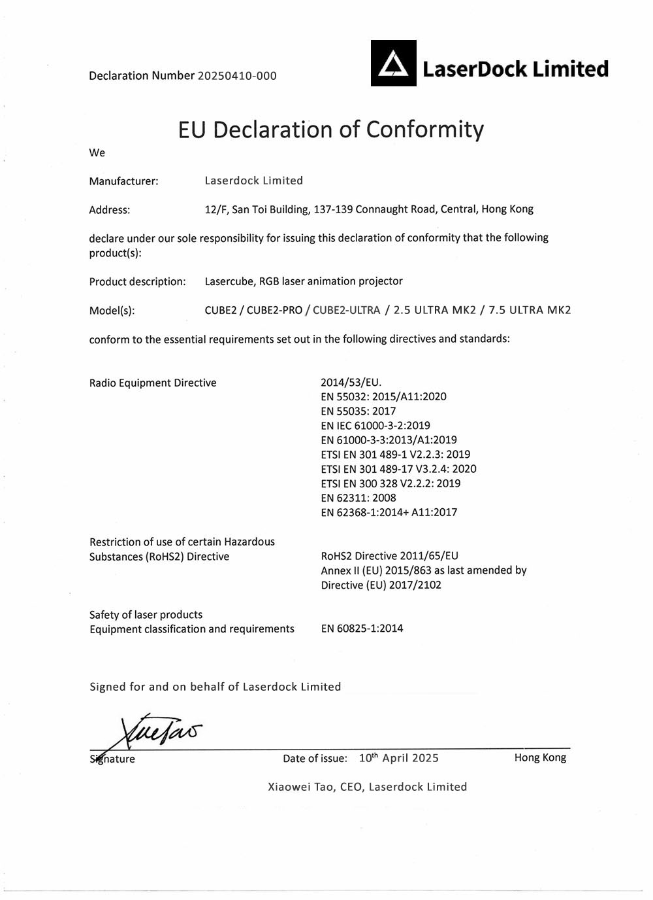

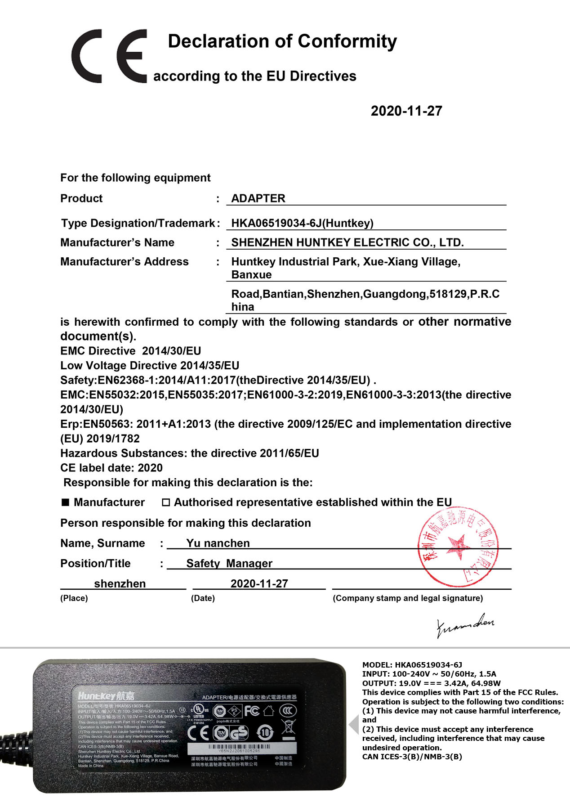

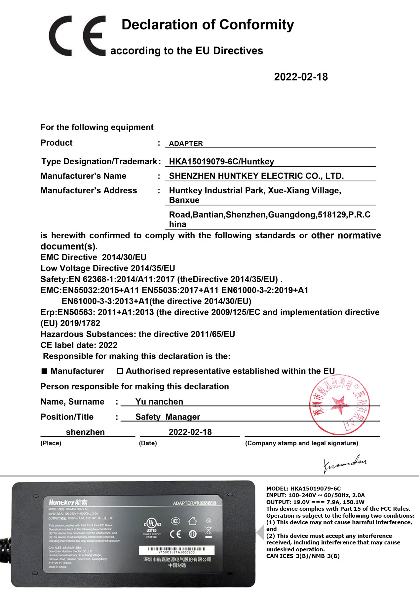

# 

# Safety Warning

 **WARNING!**

**LASER RADIATION**

**AVOID EYE OR SKIN EXPOSURE TO**

**DIRECT OR SCATTERED RADIATION**

**CLASS 4 LASER PRODUCT**

**BEFORE USING THIS PRODUCT, READ AND FOLLOW ALL NOTICES AND SAFETY
INFORMATION THROUGHOUT THIS GUIDE.**

**THIS LASER PRODUCT IS NOT TO BE USED OUTDOORS**

**Some US states require additional licensing and/or registration. Many
locations require operation only under the supervision of a trained
Laser Safety Officer (LSO).**

**FOR PROFESSIONAL USE ONLY.**

12/F, San Toi Building, 137-139

Connaught Road Central, Hong Kong

Email: support@laseros.com

If you have any questions about any of the content of this manual

or the safe operation of your new laser projector, please do not
hesitate

to contact LaserDock Ltd. directly.

# LaserCube Parts Diagram

1.  **Laser Aperture:** Laser light is emitted from this opening.
2.  **Beam Block:** Prevents laser emission and also restricts the laser
    scan from going into an audience. Can be locked using the screws
    either side.
3.  **Mounting Bracket:** For secure installation. Tilt may be locked
    using Screws 3a
4.  **WiFi Antenna Connector:** to facilitate wireless connection.
5.  **Status LED:** For showing Connection Mode.
6.  **RJ-45 Ethernet Port:** For cable connection to network.
7.  **Safety Key Control:** Prevents accidental operation. Resetting of
    the key control will be required if there is a power loss or remote
    interlock cycling.
8.  **RJ45 Remote Interlock Connectors:** In/Through. Provides a safety
    shut-off for terminating the laser emission via a jumper connection.
    *A jumper is included with the product*.\* Do not attach Ethernet
    devices to these connectors.

> *\*For the **US LaserCube** model, the jumper is not included. It is
> required to be operated with an E-Stop for FDA compliance and will not
> work with only the safety jumper installed. *

> 

9.  **Emission LEDs:** Indicate when the Laser is emitting or ready to
    emit.
10. **Power Switch:** Toggles the power ON or OFF.
11. **Power LED:** Indicates when the Power Switch is ON.
12. **Power (19V DC) Input:** Power connection/charging port via wall
    outlet.
13. **Charging Status LED indicator:** Red = Charging, Green = Fully
    Charged
14. **Rotary / Push Menu Knob:** Navigate Cube OS and adjust settings.
15. **LCD Display for CubeOS**.
16. **USB Port:** Connect a USB MIDI device (APC40Mk2 / APC Mini Mk2)
17. **MicroSD Card slot:** Stores content for MIDI, ArtNet, DMX and
    Stand Alone mode.
18. **Internal Microphone:** Audio input source for built-in
    visualisers.
19. **3.5mm Audio Line Input:** Audio input source for built-in
    visualisers
20. **3.5mm Audio Line Output:** Audio Laser show output to powered
    speakers.
21. ILDA Ports (In/Out):

> **21a. ILDA Input Connector: DB25 Male:** The Laser cube will
> automatically change from the internal LaserOS DAC to an external ILDA
> compatible DAC if connected to this port.

> In the settings for the software that accompanies the external DAC, we
> suggest configuring the scan rate to 30000 points per second.

> **21b. ILDA Output Connector: DB25 Female:** Duplicate of the internal
> LaserOS DAC signals, of those of an external DAC when connected to the
> ILDA input.

> 

22. **DMX connectors (In/Out):** Connect to a lighting desk / controller

> **22a.** DMX Input

> **22b.** DMX Output

> 

23. **Safety Eye Bolt:** When mounted at height, attach safety cable
    through the eye.

> 

>  src="ULTRA_MK2_Full_Manual_v1-3/Pictures/1000000100000522000007BCC49CE081.png"
> style="width:15.171cm;height:22.86cm" />

# 

# Technical Specifications

7.5 Ultra MK2

<table>
<tbody>
<tr>
<td>Name:</td>
<td>LaserCube</td>
</tr>
<tr>
<td>Model:</td>
<td>7.5 Ultra Mk2</td>
</tr>
<tr>
<td>Laser Class:</td>
<td>Class 4</td>
</tr>
<tr>
<td>Power:</td>
<td>7500mW</td>
</tr>
<tr>
<td>Blue 455nm:</td>
<td>4000mW</td>
</tr>
<tr>
<td>Green 525nm:</td>
<td>2000mW</td>
</tr>
<tr>
<td>Red 638nm:</td>
<td>1500mW</td>
</tr>
<tr>
<td>Battery:</td>
<td>92.16Wh </td>
</tr>
<tr>
<td>Modulation:</td>
<td>Analog 70kHz</td>
</tr>
<tr>
<td><strong>Scan speed:</strong></td>
<td><strong>&gt;35,000pps @ 7 deg</strong></td>
</tr>
<tr>
<td>Max Scan Angle:</td>
<td>&gt;37 degrees</td>
</tr>
<tr>
<td>Connectivity:</td>
<td>
WiFi RP-SMA Female, 2.4GHz 
Ethernet RJ45 connector, 100Mbps

ILDA Ports (In/Out)

DMX Ports (In/Out)

USB-A Port (for APC USB MIDI device)

3.5mm Stereo Line Audio Ports (In/Out)

MicroSD card socket

Interlock RJ45 connectors (In/Through)
</td>
</tr>
<tr>
<td>Size:</td>
<td>15.5 x 15 x 15.5 cm</td>
</tr>
<tr>
<td>Weight:</td>
<td>3.7 kg</td>
</tr>
<tr>
<td>Voltage:</td>
<td>19V DC, 120W adapter</td>
</tr>
<tr>
<td>Warranty:</td>
<td>1 year</td>
</tr>
<tr>
<td>Software:</td>
<td>Internal CubeOS + <a
href="https://www.wickedlasers.com/laserdock"><em>LaserOS Included</em></a></td>
</tr>
<tr>
<td>Safety:</td>
<td>Features key, interlock, beam block, indicator LED. Complies with
latest safety standard IEC 60825-1</td>
</tr>
</tbody>
</table>

2.5 Ultra MK2

<table>
<tbody>
<tr>
<td>Name:</td>
<td>LaserCube</td>
</tr>
<tr>
<td>Model:</td>
<td>2.5 Ultra Mk2</td>
</tr>
<tr>
<td>Laser Class:</td>
<td>Class 4</td>
</tr>
<tr>
<td>Power:</td>
<td>2500mW</td>
</tr>
<tr>
<td>Blue 455nm:</td>
<td>1300mW</td>
</tr>
<tr>
<td>Green 525nm:</td>
<td>800mW</td>
</tr>
<tr>
<td>Red 638nm:</td>
<td>400mW</td>
</tr>
<tr>
<td>Battery:</td>
<td>92.16Wh </td>
</tr>
<tr>
<td>Modulation:</td>
<td>Analog 70kHz</td>
</tr>
<tr>
<td><strong>Scan speed:</strong></td>
<td><strong>&gt;35,000pps @ 7 deg</strong></td>
</tr>
<tr>
<td>Max Scan Angle:</td>
<td>&gt;37 degrees</td>
</tr>
<tr>
<td>Connectivity:</td>
<td>
WiFi RP-SMA Female, 2.4GHz 
Ethernet RJ45 connector, 100Mbps

ILDA Ports (In/Out)

DMX Ports (In/Out)

USB-A Port (for APC USB MIDI device)

3.5mm Stereo Line Audio Ports (In/Out)

MicroSD card socket

Interlock RJ45 connectors (In/Through)
</td>
</tr>
<tr>
<td>Size:</td>
<td>15.5 x 15 x 15.5 cm</td>
</tr>
<tr>
<td>Weight:</td>
<td>3.7 kg</td>
</tr>
<tr>
<td>Voltage:</td>
<td>19V DC, 120W adapter</td>
</tr>
<tr>
<td>Warranty:</td>
<td>1 year</td>
</tr>
<tr>
<td>Software:</td>
<td>Internal CubeOS + <a
href="https://www.wickedlasers.com/laserdock"><em>LaserOS Included</em></a></td>
</tr>
<tr>
<td>Safety:</td>
<td>Features key, interlock, beam block, indicator LED. Complies with
latest safety standard IEC 60825-1</td>
</tr>
</tbody>
</table>

# Product Labelling and Placement

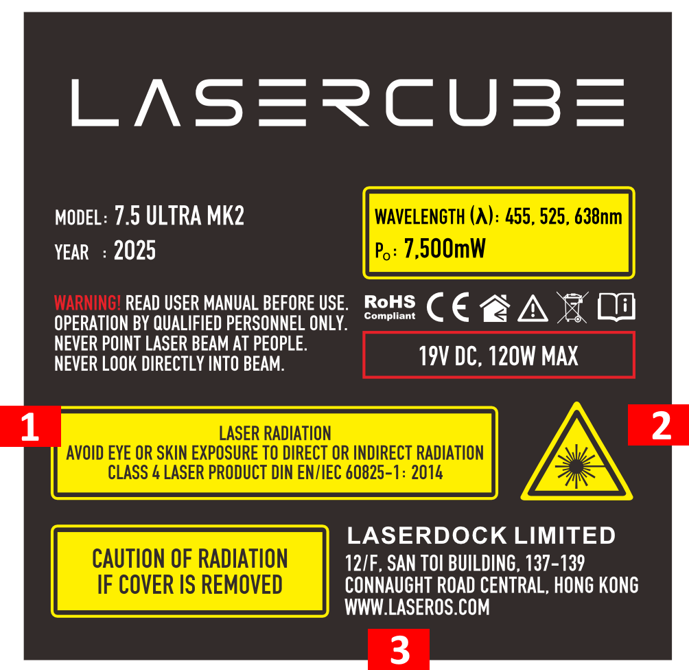

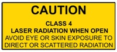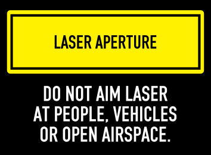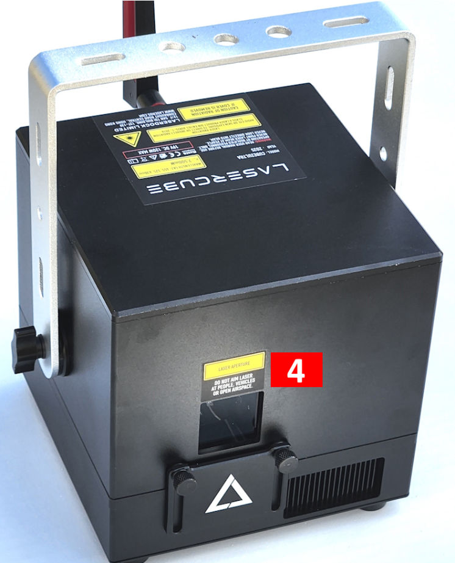

# Safety Guidelines and Proper Usage

1\. No scheduled maintenance necessary to keep the product in
compliance. Simply keep the laser free from dust or other contaminates
that could cloud or dirty the laser aperture. Cleaning the aperture
window and vents are the ONLY maintenance allowed and must be performed
with the unit powered down and locked off. **Servicing by the user is
not allowed. Any attempt to open or modify the unit is prohibited.
Instant permanent blindness may result in case of an accidental eye
exposure to the beam.**

2\. Do not expose the human eye directly or indirectly to focused or
scattered laser radiation as loss of vision, complete blindness, and/or
other serious injuries may result. Lasers are capable of starting fires
at great distances. Do not use around flammable materials.\*

3\. Do not take apart, modify or dismantle the laser or operate it under
abnormal current load (doing so will void the warranty). Strictly no
service is allowed. Servicing should only be handled by authorized
factory trained technicians.

4\. Always treat your laser with great care as some components are very
fragile and must not be subjected to shock.

5\. Avoid turning the laser on and off frequently as it will reduce the
diode life. This device does not have a set duty cycle but we do not
recommend using it for more than four hours continuously.

6\. From time to time, clean the laser aperture with a dry tissue that
does not pill. You may also use an alcohol prep wipe and compressed air
to blow dust from the vents. BE SURE the alcohol has dried fully before
activating the laser. **Cleaning the aperture and vents are the only
user maintenance allowed and can ONLY be performed with the unit powered
down and locked off.**

7\. Always keep all factory supplied labels on the unit and visible.
These are required for legal compliance.

8\. During use, be sure to leave an open space around all sides of the
laser to facilitate airflow through the heat sink beneath the device.

9\. Operate your laser only within the specified temperature range of
10°C (50°F) to 40°C (104°F). Failure to do so may result in weak output,
overly strong output which will diminish the life of the unit and/or
large output power swings. The LaserCube is thermostatically monitored
so we can determine if a failure was temperature related. Such failures
are NOT covered under our manufacturer’s warranty. Extreme cold and hot
temperatures WILL cause a diode failure. Keep this unit climate
controlled at ALL times.

10\. Always ensure that the main power supply is properly grounded
before use. Do not use a 2 prong IEC cord with this projector. You
should always hook up a laser system in such a way that you have both a
primary and backup means of instantly terminating laser emissions.

11\. DO NOT USE the laser device if you suspect that it contains a
defect of any kind either from manufacturing, damage, general wear or
has a broken manufacturer’s seal. Contact us to return the unit to the
factory for service and/or maintenance immediately.

12\. Should you have difficulty operating the laser properly and
troubleshooting does not work, go to
[www.LaserOS.com](https://www.laseros.com/) for support and RMA
assistance if necessary. Do not attempt to service, modify or fix the
laser yourself. You will be provided with instructions on how to send
the laser projector back for repair.

13\. Before using this product in any capacity, ensure that the unit is
properly secured to prevent accidental beam shifts and that a safety
cable is used for any aerial rigging.

14\. This product is not a toy and should be kept inaccessible to
unauthorized persons before, during, and after use. Keep away from
minors.

15\. The LaserCube includes all required safety features per
international regulations. For US residents, authorized persons should
only be employees of an FDA variance holder.

16\. This product is not to be used outdoors. Do not allow laser light
to escape indoor settings as this level of laser light can interfere
with Aircraft operation at many miles. DO NOT allow lasers to hit
aircraft or enter airspace. Shining a laser at an aircraft in the US is
considered a federal crime punishable by fines or jail time.\*\*

17\. Before using this product, it is the responsibility of the user to
be familiar with all Federal and State reporting and usage requirements.
Laws vary by state, some US states require additional licensing and/or
registration. Many locations require operation only under the
supervision of a trained Laser Safety Officer (LSO). An FDA variance is
required to operate this product in the United States.

18\. For all venues you must designate safe and restricted areas of the
venue where persons are or are not allowed to be respectively. The “safe
areas” should not be subject to any laser radiation either directly or
indirectly. By protocol, there must be at least a 3 meter buffer between
safe and restricted areas on all sides. In other words, all laser beams
must terminate (ie. not be reflected away) in the restricted areas to
avoid human contact. The laser must never be aimed at or allowed to be
directed or reflected toward other people or reflective objects.

19\. Do not stand in front of the laser while active. All persons should
wear protective eyewear while rigging, maintaining, or otherwise working
with the laser.

\*Failure to follow the above precautions and other precautions
contained in this user manual, particularly with regard to human
exposure to laser radiation and electrical safety, may result in serious
injury, loss of vision, electric shock or skin damage. Class 4 lasers
must be handled and operated with care and extreme caution.

\*\*This product shall NOT be operated by persons who are not trained in
proper laser safety procedures and/or do not know how to use all
components of a laser system properly. The safety procedures outlined in
this manual must be observed at all times to provide you with safe and
fun laser displays. Please contact us if you have any questions about
how to safely and effectively use our products!

For more safety information & guidance please refer to:

[**IEC/TR 60825-3:2022 Laser Show
Guidance**](https://www.en-standard.eu/iec-tr-60825-3-2022-safety-of-laser-products-part-3-guidance-for-laser-displays-and-shows/)

[*https://www.en-standard.eu/iec-tr-60825-3-2022-safety-of-laser-products-part-3-guidance-for-laser-displays-and-shows/*](https://www.en-standard.eu/iec-tr-60825-3-2022-safety-of-laser-products-part-3-guidance-for-laser-displays-and-shows/)

### **Abstract**

IEC/TR 60825-3:2022

Safety of laser products - Part 3: Guidance for laser displays and shows

IEC TR 60825-3:2022 gives guidance on the planning and design, set-up
and conduct of laser displays and shows that make use of high power
lasers emitting output between 380 nm and 780 nm.

This document is a code of practice for the design, installation,
operation and evaluation of the safety of laser light shows and
displays, and the equipment employed in their production. This document
is also intended for persons who modify laser display installations or
equipment.

The laser power needed to produce visually effective theatrical or
artistic displays in large spaces such as theatres, arenas, or
architectural sites is great enough to pose a severe accidental exposure
hazard, even when personal exposure is very brief. For this reason, IEC
TR 60825-14 states that only laser products that are Class 1, Class 2 or
visible-beam Class 3R should be used for demonstration, display or
entertainment purposes in unsupervised areas. Only under carefully
controlled conditions and under the control of a trained experienced
operator can laser products of higher classes be used for visual
entertainment.

This document expands upon the principles considered in IEC TR 60825-14,
providing specific technical guidance appropriate for the safe use of
laser products used for the purposes of visual entertainment.

# 

# Enabling the Laser E-Stop / Interlock

#### 

<figure>
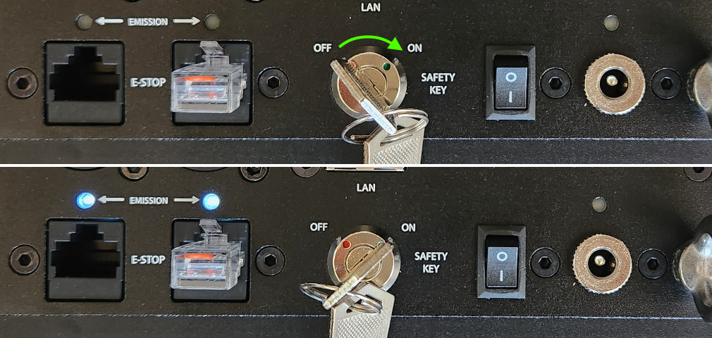
<figcaption aria-hidden="true"></figcaption>
</figure>

# 

# E-STOP Setup Guide

This part of the guide is only relevant to the US version of the MK2.

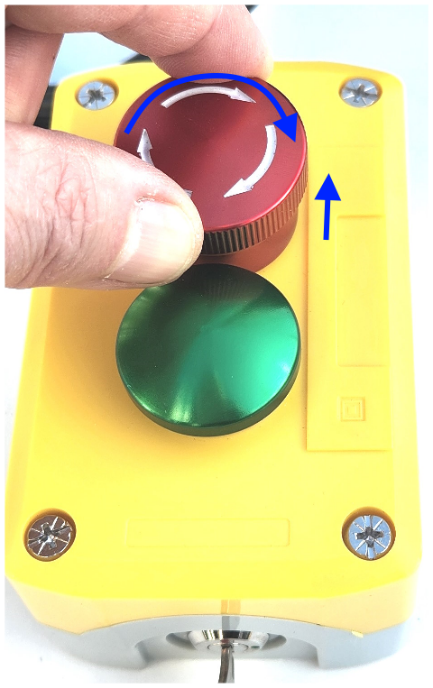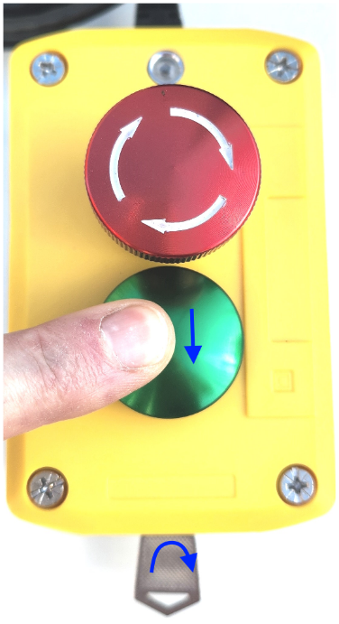

1\) Connect the e-stop pendant to the LaserCube.

2\) On the laser, turn key to the "ON" position.

3\) On the e-stop pendant, if the red STOP switch is pushed in, rotate
clockwise until it can be raised.

4\) On the e-stop pendant, turn the key clockwise to the “ON” position.

5\) With the red STOP switch raised plus keys on both the laser and
pendant set to the “ON” position the Interlock / Emission LEDs will
flash slowly, once every 3 seconds.

6\) After the second flash, the laser may be enabled by briefly pressing
the green START button. The Interlock / Emission LEDs will begin
flashing more quickly, once every second. After 10 seconds the LEDS will
remain solidly on and the laser will be capable of emission.

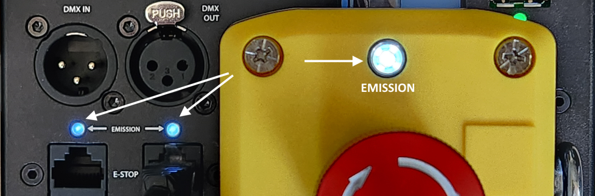

NOTE: In case of an emergency and you need to stop the laser, press the
big red button.

# **Hardware Installation**

1\. Adjust the beam block with the unit powered off, make sure the key
is not connected, secure projector aiming, then make adjustments to the
beam block.

Note: You may need to repeatedly power the laser back on to check for
the proper beam block setting until it prevents any scanning into
audience areas. All beams must be maintained at least 3 Meters (10 feet)
above the floor level where people may be present. **Eye exposure to
laser light can cause instant injury and permanent blindness.**

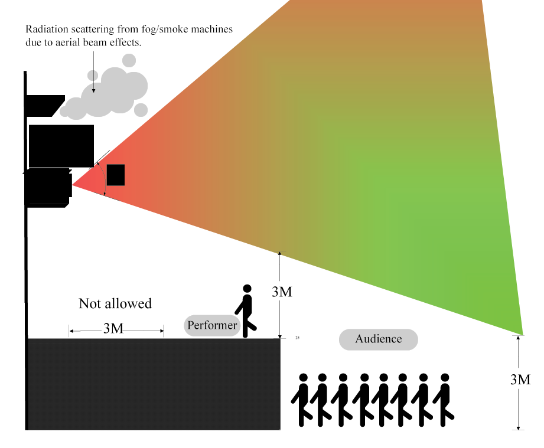

2\. Place appropriate compliant ANSI area warning sign(s) in and around
the laser show venue especially areas accessible to the audience.

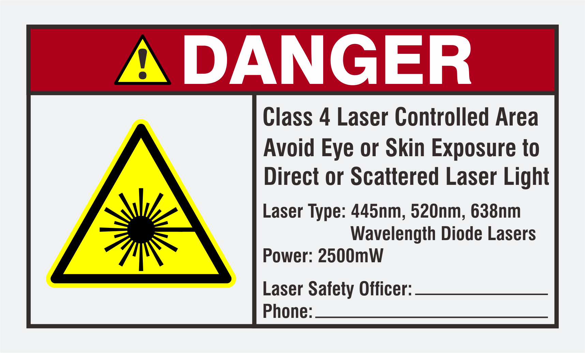

**Visit** [**www.laseros.com/guide**](http://www.laseros.com/guide)
**for the full LaserOS guide.**

**Visit**
[**www.laseros.com/wiki**](http://www.laseros.com/wiki) **for the online
Ultra Mk2 guide.**

# CubeOS LCD Settings and Status

The rear panel LCD displays certain status information and allows
configuration of the Control Mode and Connection Settings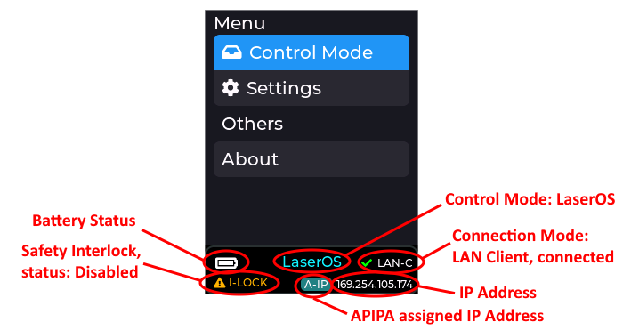

# MK2 Control Modes

The MK2 currently has 6 modes available to the user.

- LaserOS control mode
- ArtNet control mode
- DMX control mode
- Visualizer control mode
- Playlist control mode
- Laser show control mode

## LaserOS Control Mode

This mode is used when you want our LaserOS application to be in
complete control of the MK2 laser cube, or you wish to use any of the
supported third party applications like Liberation, or LaserShowGen etc.

In this mode all projections are streamed over LAN/WiFI directly to the
MK2 laser cube, so the Settings→Projection menu items will not be
available since these are now adjusted via the LaserOS settings menu, or
other third party software.

1)  Select Control Mode, LaserOS

>  src="ULTRA_MK2_Full_Manual_v1-3/Pictures/10000000000000F000000140A5F3C3F9.png"
> style="width:3.293cm;height:4.392cm" /> src="ULTRA_MK2_Full_Manual_v1-3/Pictures/10000000000000F000000140F4DB06AC.png"
> style="width:3.293cm;height:4.392cm" />

> 

2)  Select Settings, Connection (LAN Client preferred where local WiFi
    is congested)

>  src="ULTRA_MK2_Full_Manual_v1-3/Pictures/10000000000000F000000140093C94D8.png"
> style="width:3.507cm;height:4.674cm" /> src="ULTRA_MK2_Full_Manual_v1-3/Pictures/10000000000000F00000014036541C9C.png"
> style="width:3.493cm;height:4.657cm" /> src="ULTRA_MK2_Full_Manual_v1-3/Pictures/10000000000000F000000140A1880E4F.png"
> style="width:3.493cm;height:4.657cm" />

> 

3)  If using WiFi server, connect to the Laser cube’s Access Point. By
    default, the SSID is LaserCube. The default WiFi password is
    Laser2020. These may be changed under Settings, Network, WiFi
    Server.

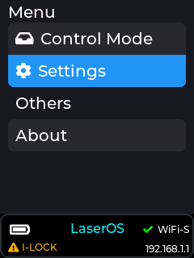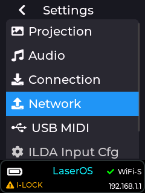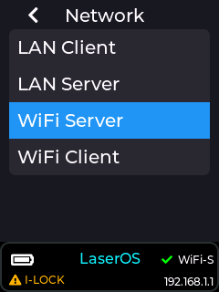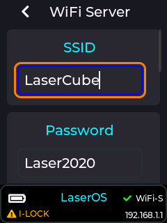

4)  If using LAN, we recommend using LAN Client. If no DHCP server is
    present on the network to assign an IP address, the Laser cube will
    self-assign an APIPA address.

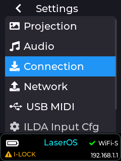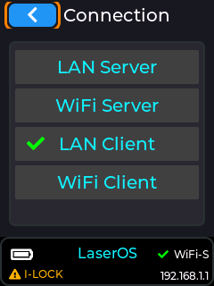

> If changing connection method, the Laser cube may ask to reboot.
> Highlight “YES” using the red cursor box then push the encoder knob to
> confirm.

> 

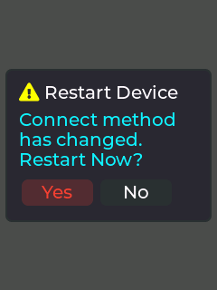

### Installing LaserOS 0.17.7 or later

Before you can add content to your MK2, or directly stream to it, our
LaserOS desktop software must firstly be installed onto your PC/Mac. Go
to <http://www.laseros.com/> and scroll down until you see the download
links as shown in the image below:

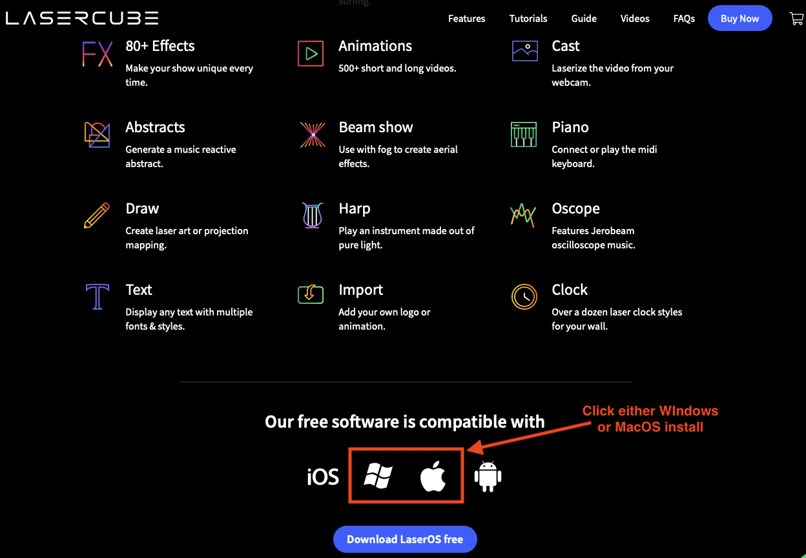

Alternatively, you can use the direct web links provided below for
PC/Mac operating systems.

Note: You cannot use the iOS or Android version of LaserOS to export to
the MK2 SD card. Mobile platforms are for direct streaming to cubes
only. Adding content must be done via PC/Mac version.

#### Windows Platform

- Follow this link to [download for PCs running
  Windows](https://laseros.s3.amazonaws.com/releases/LaserOS64_Setup.exe)*.*
- Double click on the downloaded .exe file to install LaserOS.  
- Occasionally, Windows will display the following warning.  Click on
  “more info” to enable the “run anyway option”.  Click on “run anyway”.

#### 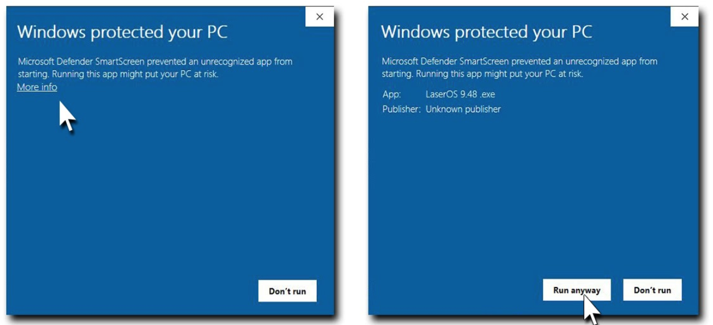 MacOS Platform

- Follow this link to [download and install for Mac
  OS](https://laseros.s3.amazonaws.com/releases/LaserOS.pkg)*.*
- Double-click on the .pkg file and run the installer app.

Follow the instructions for installing LaserOS on your chosen platform,
then run the software by opening Launchpad on MacOS, or click the icon
for LaserOS on your desktop if using a Windows platform.

### 

### Using LaserOS

After connecting your LaserCube(s) over LAN or WiFi to your network, the
LaserOS app will detect if any are connected. The LaserCube can then be
turned on or off from the power menu in the top left corner of the app.
Pressing the ESC key will also turn it off.

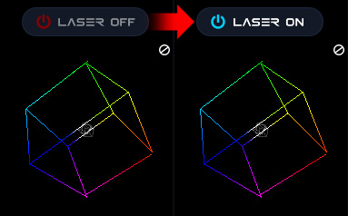

Note: While securing projector aiming, turn off the unit and remove the
key. Check for the proper beam block setting. Repeat until beam block
prevents any scanning into audience areas.

From the main menu, you can easily select from the different apps, modes
and laser show effects available. Audio, power level, colour/hue and
other settings can also be adjusted from here.

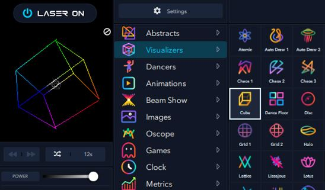

## Playlist Control Mode

This control mode is used to play custom playlists exported from our
LaserOS app to the SD card.

It can be selected by going to the Control Mode menu and selecting
“Playlist” from the options.

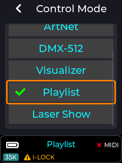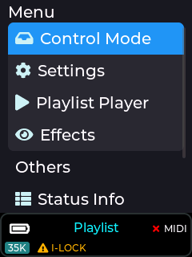

### Creating a custom playlist

Before being able to project content on the Mk2 in playlist mode you
must first create a playlist or export an existing playlist to the MK2
SD card using the desktop version of our LaserOS software.

The method of adding new content to the MK2 is via a LaserOS playlist,
by either selecting an existing one you already created, or by creating
a new one from scratch.

You can create a new playlist by selecting the playlists app from the
centre pane, then click the small ‘+’ icon as shown in the image below:

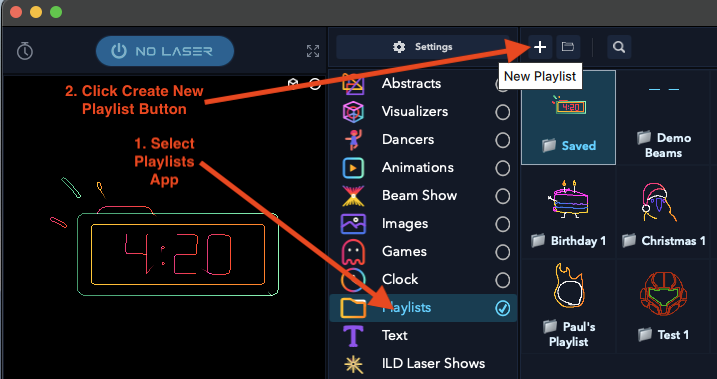

Once you create a playlist, you will now be able to drag content from
the various categories into the playlist pane on the right hand side.
You can also add content to a playlist by right clicking on any CUE
within laserOS, and then use the “add to playlist” button.

This is the method we will show in this document, so for now you can
simply save the empty playlist with the name of your choice as shown
below:

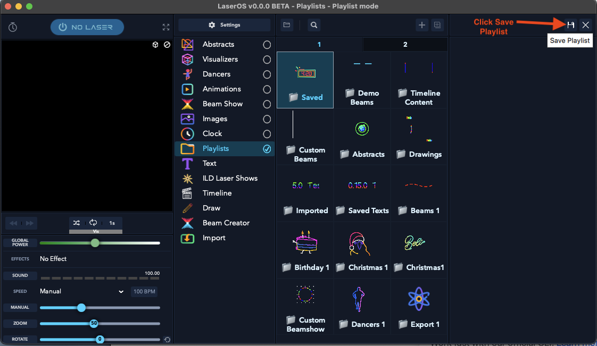

When you click the “save playlist” button you will need to give the
playlist a name. Keep this name as short as possible, as the MK2 can
only display a limited number of characters on the LCD when selecting a
playlist from the drop down menu on the MK2 LCD.

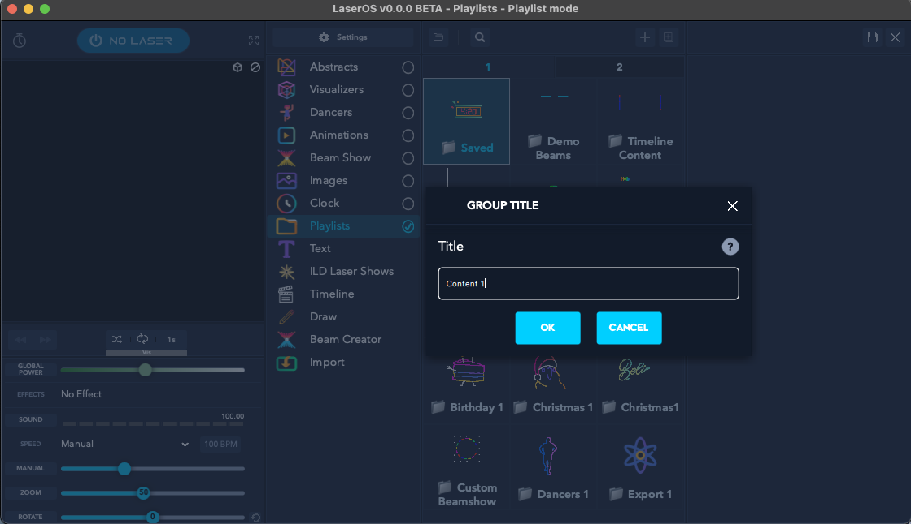

In this example guide we name the new playlist “Content 1”.

Now you have a custom playlist added, it is now possible to add content
to the playlist by selecting items from the various LaserOS categories
and right clicking on the CUE you wish to add to the playlist.

When you right click on a CUE (Animations→Vectors→Axe Chop in our
example), a pop-up menu will appear which will then allow you to select
the newly created playlist from the “Add To Playlist” drop-down, then
click the “Add” button to add the item to the chosen playlist as shown
below:

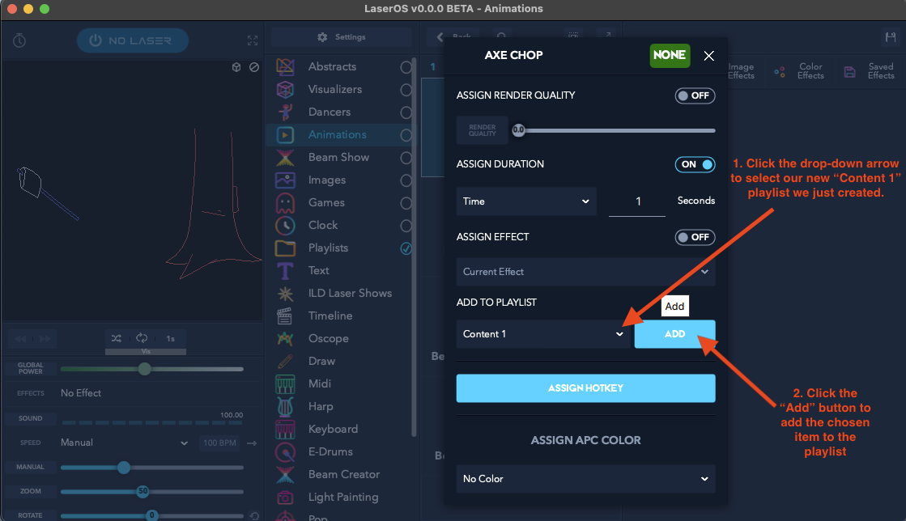Note: The above image also shows
a manual “Assign Duration” option which can be set to disabled for now,
and its purpose is described further down in this document.

### Adding a custom SVG to the Playlist

If you have any custom content you wish to display with the MK2 such as
a company logo in SVG file format, you can add this to the playlist by
using the import app within LaserOS.

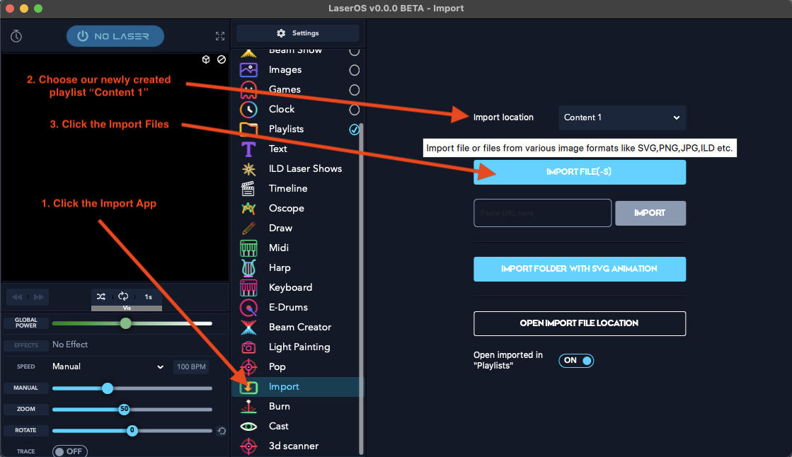

Select the import app, then select the playlist you wish to import
content into, then click the import files button.

Note: If you have an animated SVG then you would click the “import
folder with SVG animation instead”. See the LaserOS video tutorials on
laserOS.com for more info on this feature.

Select the SVG file you wish to add using the file browser window which
appears after clicking the “import File button”

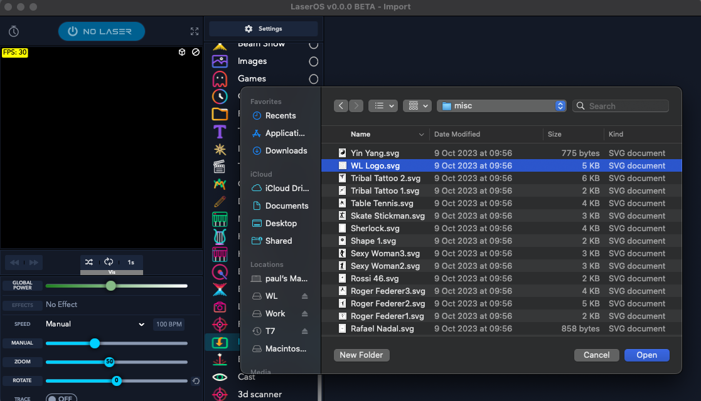

In our example we are importing the Wicked Lasers Logo as an SVG file.

The import app will also allow other image file formats (.png, .jpg,
.ild), but for the best results we recommend using SVG or ILD formats.

If you select a non vector image format like .jpg or .png then this type
of image will need to be converted to vector format. A separate popup
window will be displayed to allow user adjustments of sensitivity, line
length and other parameters with a live preview of the result, as shown
below:

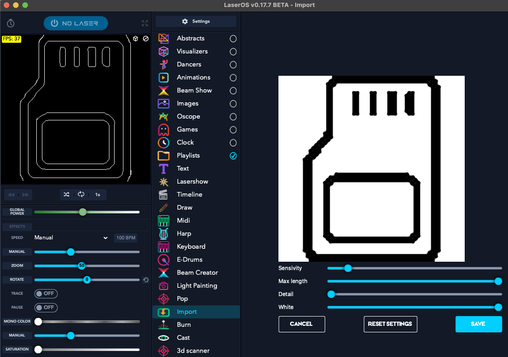

After importing your custom image you can return to the playlists app
and select the “Content 1” playlist by double clicking which will then
show all the items added to this playlist.

The playlist should contain all the items you have selected and added
via the right click popup menu. The image below shows the newly added
custom SVG called “WL Logo”

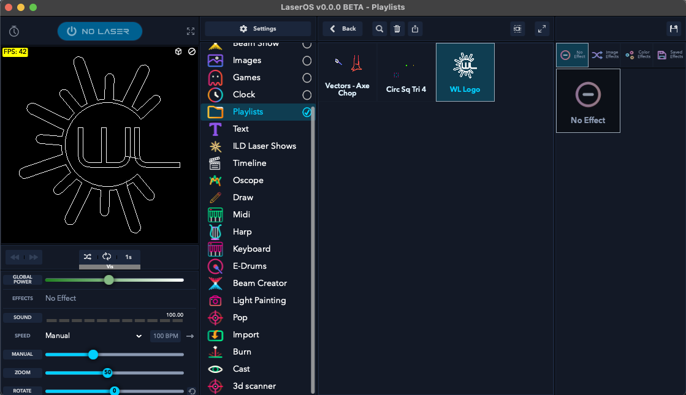

Some content imported from SVG may need its render quality changing
depending on how complex the image is. Since the Galvo Scanners can only
render a certain number of points per second you may see the projection
start to flicker if the imported SVG is too complex, or the quality
slider is adjusted to maximum quality, as the laser will need to render
more points in order to display the image with sharper corners and more
detail. You can turn on “Show FPS” in Settings→General in order to get
an idea of the frame rate the item will render at. (\>=45 FPS will not
appear to flicker).

You can adjust the render quality by right clicking on an item in the
playlist and turning on the “assign render quality” toggle followed by
adjusting the render quality slider as shown below.

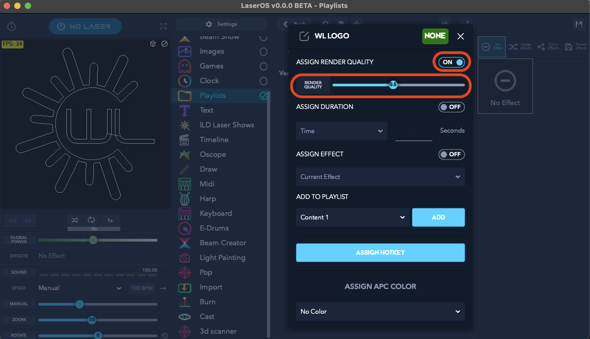

It is also possible to assign a manual duration override to the playlist
item, or set the number of times an animated item will play before the
playlist player on the MK2 moves to the next item in the playlist.

This can be seen in the previous image below the render quality slider
options.

To perform a manual playlist duration override on an item, enable
“Assign Duration” option and select either “time” or “cycles” from the
drop down.

Note: The “Beats” option is not currently supported on the MK2.

If time is selected then the number of seconds between 1 and 999 can be
entered, and if animation cycles is selected then the number of times an
animation plays can be set between 1 and 999.

The animation cycles option is especially useful when assigned to a
scrolling text item created with the LaserOS text app, as it can be set
to animation cycle of 1 so the scrolling text only displays once before
moving on to the next playlist item. If this was no set then the text
may have only partially scrolled before moving on, depending on the
playlist player CUE delay time.

Note: The “Assign Effect” option in right-click CUE popup is not
currently supported on the MK2.

### 

### Exporting a Playlist to the MK2 micro SD card

Once you have finished adding CUE’s to your new playlist, you can then
export the entire playlist to the MK2.

You will need to insert the micro SD card provided with the MK2 into a
USB 3.x reader and then connect the reader to your PC/Mac.

The SD card should appear in File Explorer / Finder as a removable
device with the volume name “WL”. The card should also contain a folder
in the root called “Lasercube”.In LaserOS, select the playlists app,
then select the playlist you wish to export, then finally click the SD
card export button as shown in the image below:

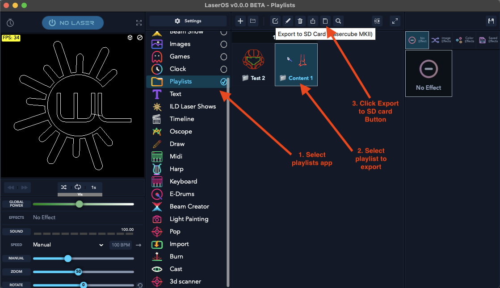

Your OS may ask for permission to access files on a removable volume, if
so then click “Allow”.

If the SD card is detected on your machine then LaserOS will show an
export progress bar depending on how many items need exporting to the SD
card.

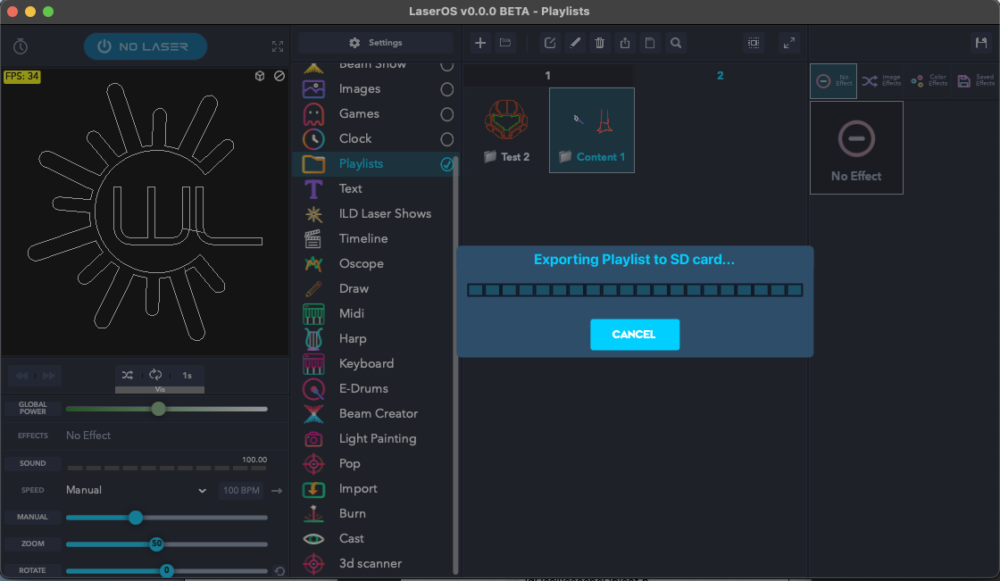

If the playlist already exists on the SD card (as you may have already
added it once before) you may be prompted as to whether you wish to
overwrite the playlist on the SD card or not, as shown below.

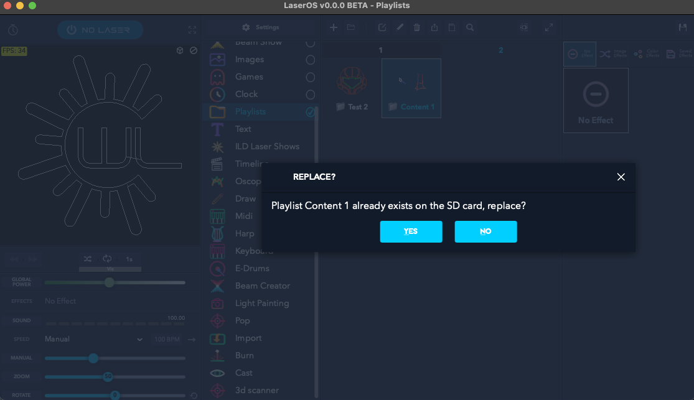

If you accept to replace the playlist then the previous playlist on the
SD card will be deleted and replaced by the current one.

If when you click the export to SD card you see an “SD card not Found”
message box, then please ensure you have inserted the MK2 card into your
reader and into your PC properly, and also check that the volume name of
the SD card is shown as “WL”. If the SD card volume name is not “WL”
without the quotes then you can right click on the removable device and
rename the card to “WL” using Windows file manager. This should only be
necessary if you have used your own SD card and forgot to rename the
volume. The SD card should also contain a folder called “Lasercube”. If
it does not then you need to download the factory SD card image again
from our GitHub here: <https://github.com/Wickedlasers/mk2SDContent>

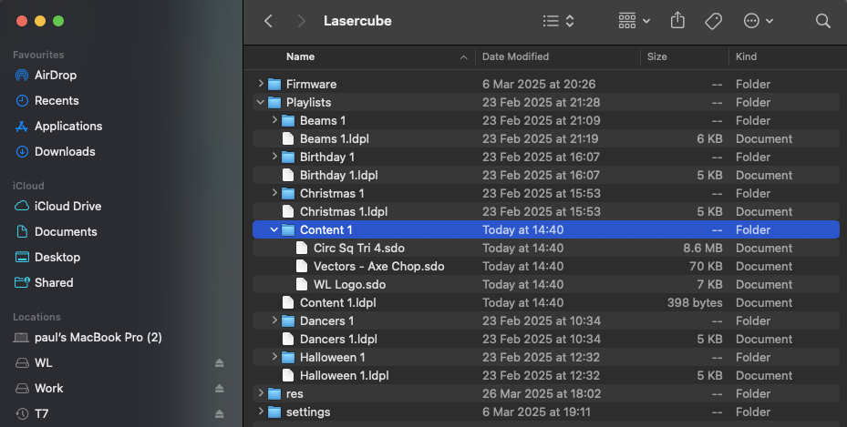The image below shows the
contents of the SD card with the new “Content 1” playlist folder and
files added.

Each playlist exported from LaserOS to the SD card also has a playlist
file which is a human readable JSON file with the extension “.ldpl”, and
each playlist also has an associated folder of the same name containing
the actual CUE files for each item in the playlist. The order in which
CUEs will be played on the MK2 (with shuffle mode disabled) is based on
the order of the entries in the “.ldpl” file.

*Note: Both the folder and playlist “.ldpl” file must be present for the
playlist to be available on the MK2. e.g. if either “Content 1.ldpl” or
“Content 1” folder are not present then “Content 1” will not be listed
in the playlists drop down on the MK2.*

### Manual Customization of the Playlist File

The image below shows a small preview of the contents of another
playlist already provided on the factory supplied SD card for the MK2.
This is an extract of the Beams 1 playlist “.ldpl” JSON file viewed in a
text editor:

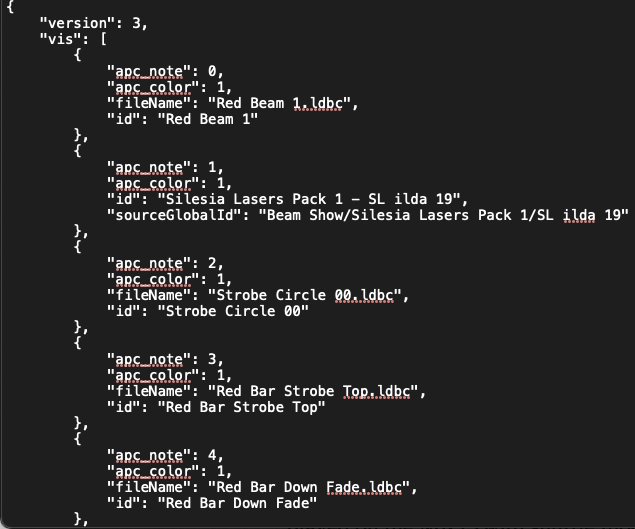

This file has been edited after export in order to add custom MIDI
mapping for an APC40 MK2 controller. “apc_note” field within the JSON
array allows the user to choose which button on the APC will activate
this playlist item.

You will need to consult the data sheet for the relevant APC MIDI device
to determine which MIDI note value corresponds to which button on the
APC.

Similarly, “apc_color” field allows the user to choose which colour the
button will be (if RGB is available on the chosen APC button).

The available values for “apc_color” field are:

|     |            |
|-----|------------|
| 1   | Red        |
| 2   | Green      |
| 3   | Blue       |
| 4   | Yellow     |
| 5   | Cyan       |
| 6   | Magenta    |
| 7   | White      |
| 8   | Orange     |
| 9   | Purple     |
| 10  | Salmon     |
| 11  | Pink       |
| 12  | Lime       |
| 13  | Cornflower |
| 14  | Mocha      |
| 15  | Ice Blue   |

If playlist items do not have these fields present in the JSON file when
an APC40 MK2 or APC mini MK2 is used in the playlist control mode then
the playlist items will be automatically allocated to the available APC
grid buttons.

Note: The MK2 has this playlist and others as part of the demo SD card
provided with the device.

### Using the new playlist on the MK2.

To project the CUE’s from the example “Content 1” playlist we just
exported from LaserOS, you need to firstly safely eject the SD card from
your PC/Mac. This can be done by right clicking the SD card in file
manager and selecting “Eject”.

Place the SD card back into the MK2 and power on the cube. Select
playlist control mode, then select the “Content 1” playlist which should
now be available in the playlist drop-down within the playlist player
menu.

The photo below shows the custom SVG that was imported to LaserOS, then
exported to the MK2 as “Content 1” playlist.

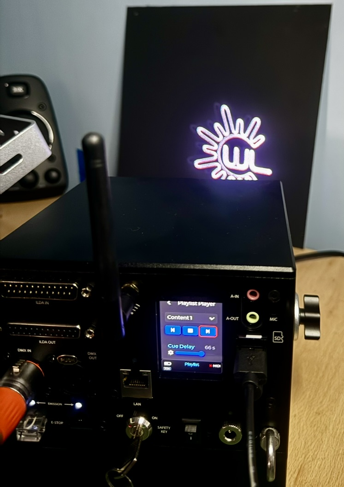

### Playlist Player UI

The playlist that the MK2 will use is selected from the Playlist
selection menu drop down.

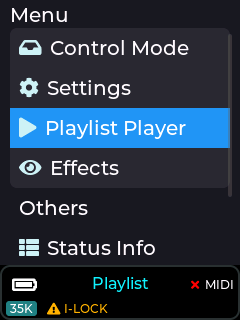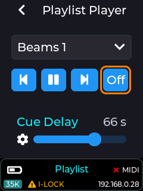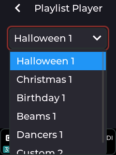

The chosen playlist selection will be saved and used again even through
a power cycle of the device.

Note: The last chosen playlist will project immediately after a power
cycle if the MK2 is in playlist control mode and “Power-On play” is
enabled in the playlist options menu, but projection will only occur
once the interlock is enabled. This is to allow for fixed installations
to quickly start up and project the users chosen content with minimal
setup time. If you do not want the playlist to automatically start
projecting at power-on, set “Power-On Play” to Disabled in the playlist
options menu.

The main media controls for the playlist player are shown below.

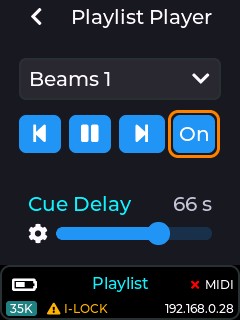

Auto-Play (when enabled) will automatically cycle through another CUE in
the currently selected playlist every \<cue delay\> seconds. Auto play
is enabled when the pause button is visible, and pressing the pause
button will move to auto-play disabled, and UI will show the play
button.

Press the play button to re-enable the CUE Auo-Play.While Auto-Play is
off, the playlist will remain at the last selected CUE.

Note: If an APC MIDI device is connected and a CUE is manually selected
using an APC button, or a CUE is manually selected via the playlist web
app, then the MK2 will no longer cycle through items in the playlist
until the Auto-play button is selected again.

The playlist can also be shuffled in order to randomize the order of
CUE’s in the playlist.

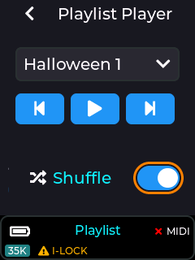

### CUE playback Speed

The user can adjust the playback speed of any CUE being projected while
in the playlist control mode.

This can be done using the Settings→Playback Speed menu

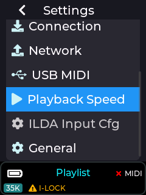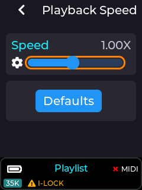

The playback speed slider can also be assigned to a MIDI knob or fader
if using an APC40 MK2 or APC mini MK2 (see [MIDI
Mapping](#16.MIDI Mapping using an APC40 MK II or APC Mini MK II|outline)
or the online wiki).

## Playlist Player Web App

The playlist control mode includes a web server which can be used to
control the MK2 from your mobile or Laptop/PC device via a web browser
(tested with Safari / Mozilla Firefox).

You firstly need to connect to the MK2 using the chosen connection
method. If WiFi server is your chosen connection method (see
settings→connection menu), then look for the network “LaserCube” in the
WiFi list and connect using the default password “Laser2020”.

Once your device’s WiFi has connected to the MK2, go to your device web
browser (Firefox, Safari etc) and enter the IP address of the cube. This
is “192.168.4.1” by default, and can be checked in settings→network, or
just look at the LCD status bar for the IP address, as it is located in
the bottom right corner.

Example image of the playlist web app being served from the MK2 to
Firefox macOS browser:

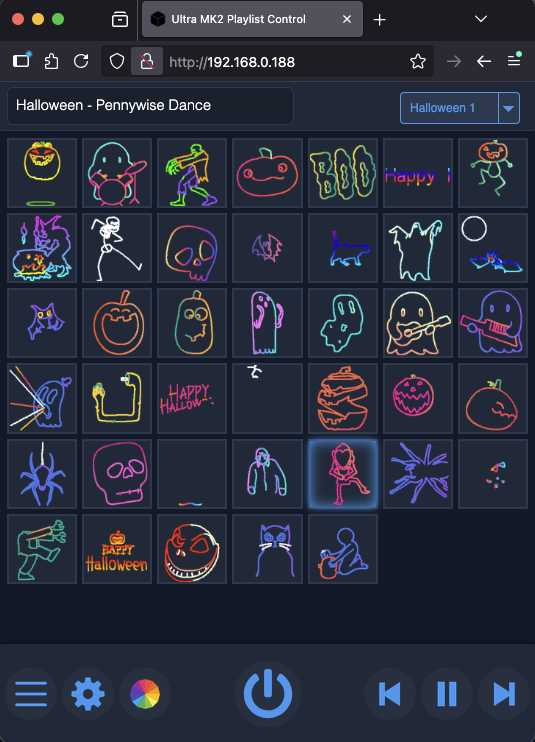

## 

### Playlist Web App Quick Image Settings

The Quick image settings allow you to adjust basic projection items such
as projection size, rotation, and output power.

An example of the quick image settings menu is shown below:

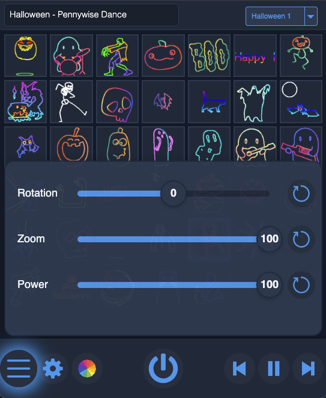

Note: Any of the image settings can be reset to their default values by
pressing the button to the right of any slider.

- Rotation

  This allows the image to be rotated from 0 to +/- 90 degrees

- Zoom

  This allows the image size to be adjusted from 10% to 100%

- Power

  This allows the projection power to be adjusted from 0% to 100%

### Playlist Web App Quick Player Settings

The Quick player settings allow changes to how the player behaves,
including its colour theme.

This menu also shows the interlock status, current battery percentage,
and cube internal temperature at the bottom of the menu.

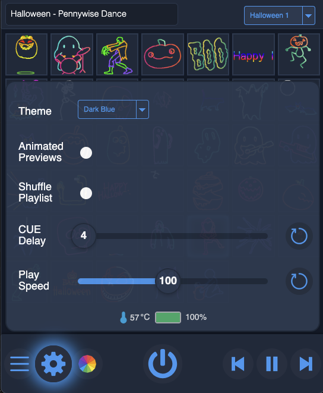

- Theme Selection

> The theme selection allows the colour theme of the web app to be
> changed. Options are Dark Blue, Icy Green, Dark Red, Pink, Purple, or
> Orange. The theme choice is stored using local web storage on your
> device’s web browser.

- Animated Previews

  This will show the playlist items as animated icons instead of static.
  Note that this is only possible on certain devices that have
  sufficient performance to allow many animated icons. (Apple devices
  have known issues with poor performance of animated image files such
  as animated .webp files, so it is recommended to have this set to
  off).

- Shuffle Playlist

  This allows the playlist items to be played in a random order, instead
  of in playlist sequence order.

- CUE Delay

  This changes how many seconds each CUE will be projected for, before
  moving on to the next CUE in the playlist (Only when Auto-Play is
  enabled).

- Play Speed

  This adjusts the animation speed of any animated projections (100 = 1x
  play speed)

### 

### Playlist Web App Quick Colour Effect Settings

This menu allows you to quickly re-colour the projection from a pre-set
palette of colours.

The colour intensity (saturation / alpha) can also be adjusted using the
Intensity Slider.

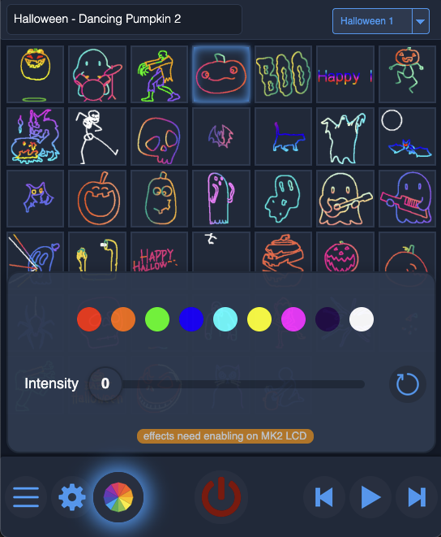

Note: The projection re-colour effect will only work if you have enabled
effects in the MK2 Effects menu. The example image above is indicating
that the effects have not been enabled in the MK2 effects menu, so will
not operate until they are enabled.

### Playlist Options Menu

The playlist options menu is present on the top level menu (below the
playlist player menu item) of the MK2 LCD when in playlist control mode

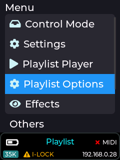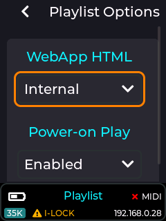

This menu allows the source of the web app html to be selected, and also
allows the user to select whether the playlist starts projecting at
power-on (immediately after interlock is enabled), or only after
activating the projection button in the playlist player or web app. The
default for power-on play is enabled, and any changes to this are
retained thru power cycle.

The Options for Web html are internal factory app (default selection),
or SD card. The SD card option is useful if the user wishes to customise
the provided web app, assuming the user has the relevant HTML/CSS/JS
knowledge.

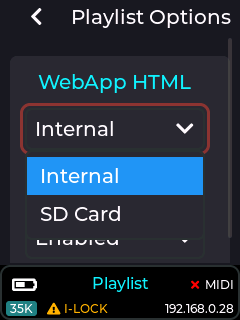

Note: The web app is provided on the latest SD card image in the
following location: /Lasercube/res/web/playlist_index.html

The file is a single html file containing all html / css / javascript to
run the web app.

*The latest SD card contents are available on our GitHub Here:* [MK2 SD
Card Contents](https://github.com/Wickedlasers/mk2SDContent)
(https://github.com/Wickedlasers/mk2SDContent)

## Laser Show Control Mode

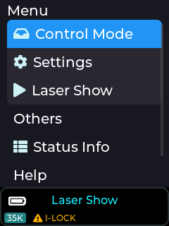 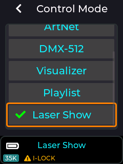 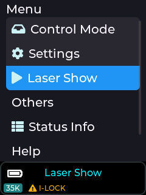

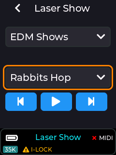 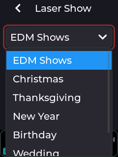 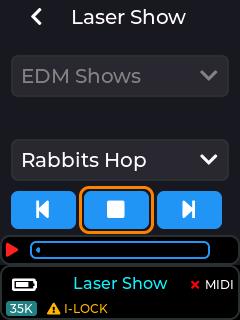

> The latest version of the laser show player now has a categories
> selection drop-down menu, allowing the user to choose the type of
> laser show to play.

> There are currently 38 shows to choose from throughout the 7 provided
> categories (EDM, Christmas, Thanksgiving, New Year, Birthday, Wedding,
> Halloween).

> 

> After choosing a category, selecting the Play icon will begin the
> show, and the player will advance to the next show in the selected
> category after the current show has finished playing. Manually
> choosing a different show from the playlist drop-down will also start
> the show, and also selecting via a connected MIDI controller.

> 

> Show audio will be played from the 3.5mm stereo audio output socket.

If Cube Link is enabled – see the Cube Link entry here: [Cube
Link](#14.5.7.Cube Link Mode|outline)

Selecting Play on a Cube Link Master will begin playback on the Master,
plus any

Cube Link Slave devices configured with the same Link Channel and PIN.

> For laser shows designed for more than one projector, ensure the Group
> number is set on each Cube Link device. Cube Link connected Slave
> devices have the status area background changed to purple. Also ensure
> all cube link devices have the same show category selected before
> starting play (e.g. all devices have “EDM Shows” selected).

> 

*Note: The Laser shows are provided on the SD card supplied with the
MK2. If no items are shown in the drop down then this could be due to
the SD card not being inserted, or not having the factory contents
present on the card. The latest SD card contents are available on our
GitHub Here:* [MK2 SD Card
Contents](https://github.com/Wickedlasers/mk2SDContent)
(https://github.com/Wickedlasers/mk2SDContent)

### Multi-projector Laser Shows

Using Cube-Link, the playback of multi-projector laser shows can be
synchronized.

*Note: Ensure WIFI Antenna’s are connected on all units before using
Cube-Link.*

#### Example: Alive (2CH) Laser Show

Choose one Mk2 Laser cube to be the Master. This will be the one which
commands

> playback to start on all the slaves. Set the Link Channel and PIN to
> be the same on all Cube Link connected devices. Select Group
> corresponding to the parts of the Laser Show, so for Alive (2CH) all
> Group 1 devices will project one part, all Group 2 devices the other.

> Master

>  src="ULTRA_MK2_Full_Manual_v1-3/Pictures/10000000000000F000000140622AC15E.png"
> style="width:3.307cm;height:4.41cm" />  src="ULTRA_MK2_Full_Manual_v1-3/Pictures/10000000000000F00000014063C21C6C.png"
> style="width:3.307cm;height:4.41cm" />  src="ULTRA_MK2_Full_Manual_v1-3/Pictures/10000000000000F000000140AC40A616.png"
> style="width:3.281cm;height:4.374cm" />  src="ULTRA_MK2_Full_Manual_v1-3/Pictures/10000000000000F000000140DCDA1340.png"
> style="width:3.281cm;height:4.374cm" />

> 

> Slave

>  src="ULTRA_MK2_Full_Manual_v1-3/Pictures/10000000000000F000000140622AC15E.png"
> style="width:3.307cm;height:4.41cm" />  src="ULTRA_MK2_Full_Manual_v1-3/Pictures/10000000000000F00000014008442071.png"
> style="width:3.281cm;height:4.374cm" />  src="ULTRA_MK2_Full_Manual_v1-3/Pictures/10000000000000F00000014017394292.png"
> style="width:3.268cm;height:4.357cm" />  src="ULTRA_MK2_Full_Manual_v1-3/Pictures/10000000000000F000000140AAE686DC.png"
> style="width:3.268cm;height:4.357cm" />

> 

> For a 2 channel show using 4 projectors, set 2 projectors to Group 1
> and 2 projectors to Group 2. Only have one configured as a master
> though.

> 

> Selecting Alive (2CH) on the master will now start projection on all
> devices, providing the same playlist (EDM Shows in this example) is
> already selected on all devices.

> 

>  src="ULTRA_MK2_Full_Manual_v1-3/Pictures/10000000000000F000000140148EAA59.png"
> style="width:3.24cm;height:4.322cm" />  src="ULTRA_MK2_Full_Manual_v1-3/Pictures/10000000000000F000000140B9E9F4BA.png"
> style="width:3.293cm;height:4.392cm" />  src="ULTRA_MK2_Full_Manual_v1-3/Pictures/10000000000000F000000140E48D960F.png"
> style="width:3.293cm;height:4.392cm" />

> 

## **Visualizer Control Mode**

There are currently 24 audio reactive visuals in the current (v0.19)
release of the MK2 firmware. More visualizers will be added in future
firmware updates.

The factory supplied SD card also includes MIDI mapping of some of these
visualizers to the APC40 MK2 / APC mini MK2 grid buttons.

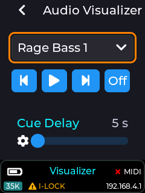

CubeOS has a number of built-in audio reactive visualizers, and these
can be manually selected via the drop-down list in addition to the
previous and next buttons.

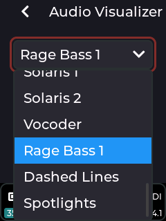

These react to the Audio Input source configured in Settings -\> Audio
-\> Audio Input, and can be either the built in microphone, or the 3.5mm
stereo audio line input jack. The audio gain may also need to be
adjusted based on the volume of the external audio.

Some of the visualizers are also affected by the current tempo setting
which can be set in Settings→Tempo menu on the LCD. The transition time
when moving between visualizer CUE’s can also be adjusted through the
Viz Options menu. Auto play at power-on can also be adjusted.

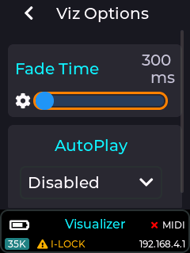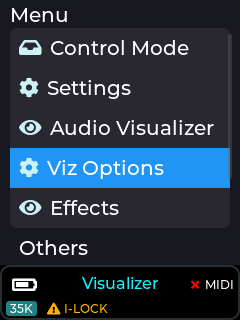

*Note: Since the audio visualizers are internally generated, live, they
will be projected as soon as the emission key-switch or pendant E-stop
is enabled.*

Spectrum1

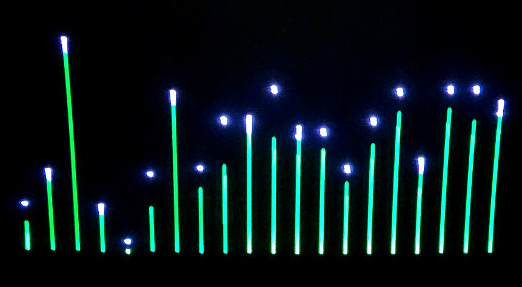

Spectrum2

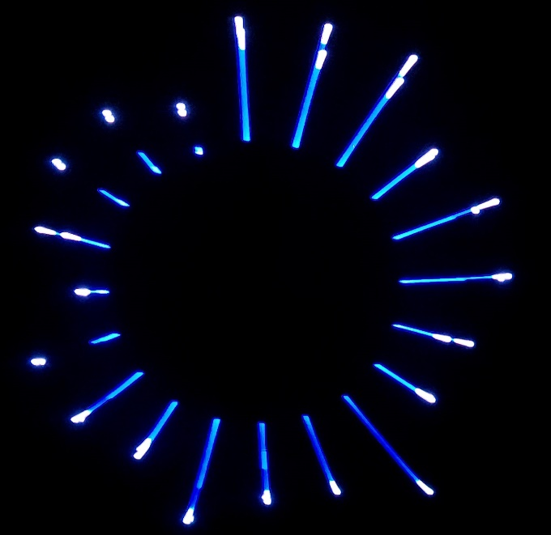

Voice

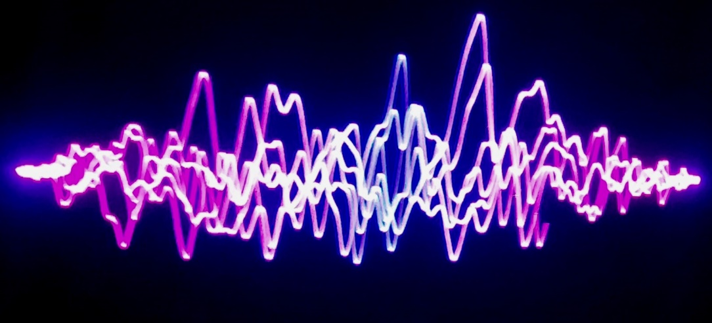

The Visualizers can also have effects added to them, configured from the
Effects menu.

See the effects page here: [Effects](#14.MK2 Built in Effects|outline)
or the online wiki for more info on the built in effects, and also the
[tempo](#14.2.Mk2 Settings – Tempo|outline) menu which will affect the
speed of some BPM based effects.

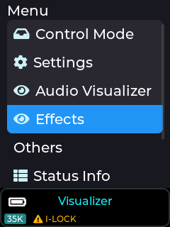 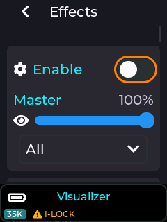

Filter UI for a single effect, or All effects

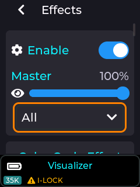 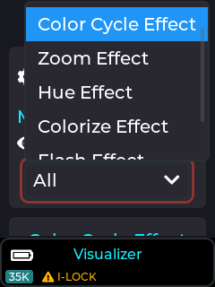

Color Cycle Effect

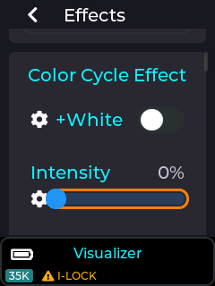 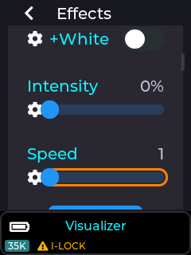

Zoom Effect

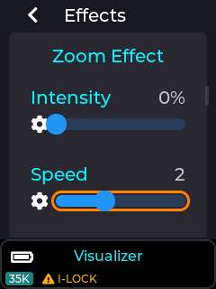 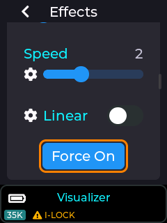

Hue Effect

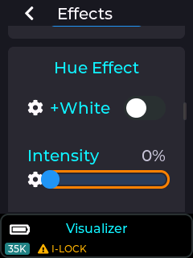 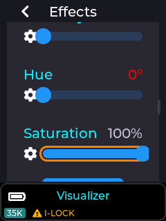

Colorize Effect Flash Effect Strobe Effect

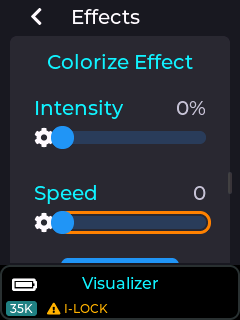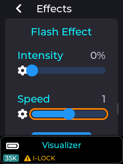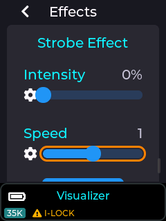

## ArtNet Control Mode

### Setting the control mode to ArtNet

The ArtNet mode can be selected by going into Control Mode and selecting
it

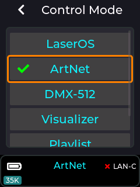

Once selected the MK2 will restart into ArtNet mode, and the ArtNet
settings will now be available from the top level menu as shown below:

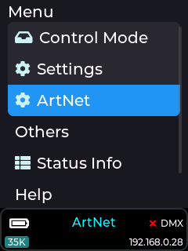

### ArtNet settings Menu

#### ArtNet Universe

This sets which universe the MK2 will respond to on the network.

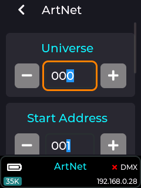

#### ArtNet Start Address

The start address can be changed (default is address 1) in order to move
the 16 channel profile start address within the ArtNet/DMX address range
of 1-512.

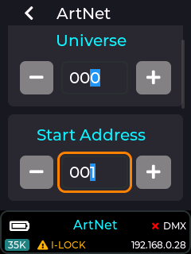

#### Fixture Profile

The Fixture profile can be changed using the fixture profile drop-down.
Currently there is only one profile available which occupies 16 channels
of the ArtNet/DMX address range.

A profile determines which ArtNet/DMX channels control what feature of
the MK2. The default 16 channel map is available on the MK2 here: [DMX
Channel
Map](#12.7.DMX/ArtNet Default Fixture Channel Allocation|outline) or the
wiki (or PDF supplied on the factory SD card).

#### 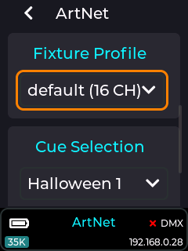

Note: The default profile is compatible with the FB3/FB4 16 channel
profile, so any DMX/ArtNet capable lighting controller with FB3/4
support should also work with the MK2.

#### CUE Selection

This drop-down will allow you to select a playlist from the SD card to
use when a CUE index is selected over ArtNet. You will need to export a
playlist from LaserOS, or use one of the provided playlists on the SD
card shipped with the unit.

The CUE selection is based on the order of items within the chosen
Playlist, so the first CUE selected over ArtNet using the CUE/Page
channel will project the first item in the playlist.

#### 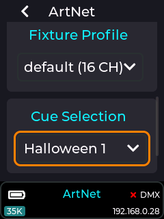

#### Defaults

This button will reset all items within the DMX menu to their factory
defaults.

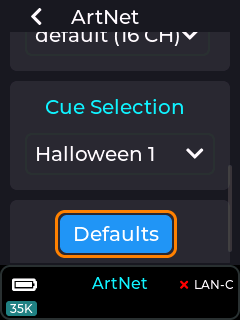

### ArtNet Status 

The status of the ArtNet connection is shown in the status bar at the
bottom right of the LCD.

When the MK2 is connected to a valid ethernet network and ArtNet packets
are being received on the correct ArtNet Universe then the status bar
will show a green tick to the right of the DMX label and a valid IP
address will be shown below it.

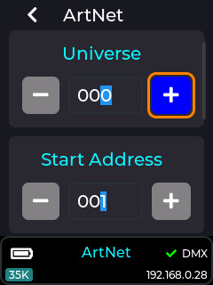

If ArtNet data is not being correctly received then the status bar will
show a red cross instead of a green tick.

If the status shows as not connected when you have an ethernet cable
attached to your network which also has the ArtNet controller present,
then please check for a network issue first like no IP address being
shown in the status bar, and also check you are on the correct ArtNet
universe.

## DMX Control Mode

### Setting the control mode to DMX

The DMX mode can be selected by going into Control Mode and selecting
DMX-512

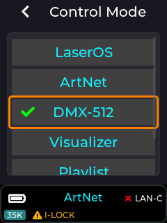

Once selected the MK2 will restart into DMX-512 mode, and the DMX
settings will now be available from the top level menu as shown below:

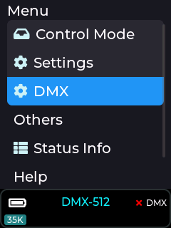

### 

### DMX settings Menu

#### DMX start Address

The DMX start address can be changed (default is DMX address 1) in order
to move the 16 channel profile start address within the DMX address
range of 1-512.

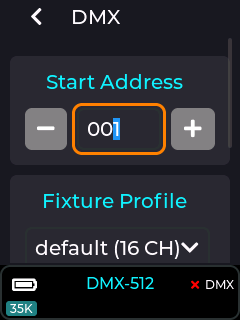

#### Fixture Profile

The Fixture profile can be changed using the fixture profile drop-down.
Currently there is only one profile available which occupies 16 channels
of the DMX address range.

A profile determines which DMX channels control what feature of the MK2.
The default 16 channel map is available here: [DMX Channel
Map](#12.7.DMX/ArtNet Default Fixture Channel Allocation|outline) or on
the wiki (or PDF on the factory supplied SD card).

#### 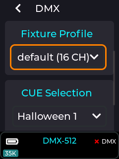

Note: The default profile is compatible with the FB3/FB4 16 channel
profile, so any DMX lighting controller with FB3/4 support should also
work with the MK2.

#### CUE Selection

This drop-down will allow you to select a playlist from the SD card to
use when a CUE index is selected using the DMX Page/CUE channel. You
will need to export a playlist from LaserOS, or use one of the provided
playlists on the SD card shipped with the unit.

The CUE selection is based on the order of items within the chosen
Playlist, so the first CUE selected over DMX using the CUE/Page channel
will project the first item in the playlist.

#### 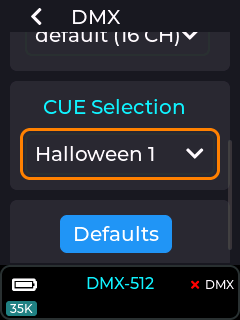

#### Defaults

This button will reset all items within the DMX menu to their factory
defaults.

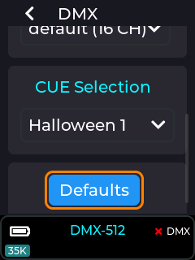

### 

### DMX Status 

The status of the DMX is shown in the status bar at the bottom right of
the LCD.

When the MK2 is connected to DMX and receiving the 512 channels via the
DMX In connector, the status bar will show a green tick to the right of
the DMX label as shown below.

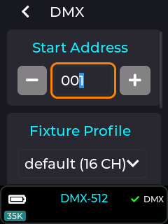

If DMX is not being received then the status bar will show a red cross.

If the status shows as not connected when you have a cable connected and
are running DMX from a controller, then please check cabling and also
check that the DMX is correctly terminated.

## 

## DMX/ArtNet Default Fixture Channel Allocation

### Overview

The default DMX/ArtNet fixture uses from 4 to 16 channels depending on
the Access Mode.

### DMX Channels NOT Implemented in the default fixture implementation

• DMX CH 12 Reserved for future use.

• DMX CH 14 Reserved for future use.

• DMX CH 16 Reserved for future use.

### DMX/Art-Net Channel Layout

|             |          |            |               |                |            |
|-------------|----------|------------|---------------|----------------|------------|
| Channel 1   | 0-31     | 33-95      | 97-159        | 161-223        | 225-255    |
| Access Mode | Blackout | Basic 4 CH | Standard 8 CH | Extended 12 CH | Full 16 CH |

Note:

• Invalid values (32,96,160,224) do not change the access mode from its
previous value.

• Access mode Basic (CH 1-4 interpreted, CH 5-16 default values).

• Access mode Standard (CH 1-8 interpreted, CH 9-16 default values).

• Access mode Extended (CH 1-12 interpreted, CH 13-16 default values).

• Access mode Full (all channels interpreted).

DMX CH 2 (Page): Used as an offset into the cue playlist.

Example:

• Page 2 plays cues from index 48 onwards.

• Page 3 plays cues from index 96 onwards, etc.

• Allows up to 432 cues per playlist (9 \* 48).

|           |      |       |       |       |       |       |        |         |         |
|-----------|------|-------|-------|-------|-------|-------|--------|---------|---------|
| Channel 2 | 0-15 | 17-31 | 33-47 | 49-63 | 65-79 | 81-95 | 97-111 | 113-127 | 129-255 |
| Page      | 1    | 2     | 3     | 4     | 5     | 6     | 7      | 8       | 9       |

Note:

• Cue selection is based on Page & Cue DMX channels.

• Page 1 = Cues 1-48, Page 2 = Cues 49-96, etc.

• Maximum of 432 cues (48 cues per page \* 9 pages).

|            |          |       |       |     |         |
|------------|----------|-------|-------|-----|---------|
| Channel 3  | 0-31     | 33-35 | 37-39 | ... | 221-223 |
| Cue Select | Blackout | Cue 1 | Cue 2 | ... | Cue 48  |

Note: Used in conjunction with channel 2 (page) in order to select cues
from the currently selected playlist.

|           |      |       |                               |
|-----------|------|-------|-------------------------------|
| Channel 4 | 0-15 | 17-31 | 33 ... 64 ... 128 ... 255     |
| Speed     | 100% | Pause | 25% ... 50% ... 100% ... 200% |

|           |                           |
|-----------|---------------------------|
| Channel 5 | 0-255                     |
| Fader     | Black ... Full Brightness |

Note: If access mode is below Standard, fade is fixed at 100%.

|           |                         |
|-----------|-------------------------|
| Channel 6 | 0-255                   |
| Scale     | Zero Size ... Full Size |

Note: If access mode is below Standard, scale is fixed at 100%.

|           |                                                         |
|-----------|---------------------------------------------------------|
| Channel 7 | 0 ... 128 ... 255                                       |
| X Size    | Negative Full Size ... Zero Size ... Positive Full Size |

Note: Negative full size = Horizontally mirrored from original.

|           |                                                         |
|-----------|---------------------------------------------------------|
| Channel 8 | 0 ... 128 ... 255                                       |
| Y Size    | Negative Full Size ... Zero Size ... Positive Full Size |

Note: Negative full size = Vertically flipped from original.

|           |                           |
|-----------|---------------------------|
| Channel 9 | 0 ... 255                 |
| Rotation  | 0 degrees ... 360 degrees |

Note: If access mode is below Extended, no rotation will occur.

|            |                           |
|------------|---------------------------|
| Channel 10 | 0 ... 128 ... 255         |
| X Position | Left ... Center ... Right |

Note: If access mode is below Extended, X Position is fixed at 128
(center).

|            |                        |
|------------|------------------------|
| Channel 11 | 0 ... 128 ... 255      |
| Y Position | Down ... Center ... Up |

Note: If access mode is below Extended, Y Position is fixed at 128
(center).

|            |                 |
|------------|-----------------|
| Channel 12 | 0 ... 255       |
| Reserved   | NOT IMPLEMENTED |

|            |                   |            |         |
|------------|-------------------|------------|---------|
| Channel 13 | 0-31              | 33-223     | 225-255 |
| Scan Rate  | Default (35K pps) | 6K-29K pps | 30K pps |

Note: If access mode is below Full, scan rate defaults to 35K pps.

|            |                 |
|------------|-----------------|
| Channel 14 | 0 ... 255       |
| Reserved   | NOT IMPLEMENTED |

|  |  |  |  |
|----|----|----|----|
| Channel 15 | 0-31 | 33-223 | 225-255 |
| Recolor | Default | RED - ORANGE - YELLOW - LIME - GREEN - CYAN - BLUE - PURPLE - PINK - RED | White |

Note: If access mode is below Full, no re-colour occurs.

• Values 33-223 re-colour the CUE linearly through the HSV colour space,

with values 225-255 re-colouring the cue to full white.

• The values 33-223 adjust the hue range between 0 and 360 degrees with
full saturation (S = 1.0, V = 1.0).

• If access mode is below Full, no re-colour will occur.

|            |                 |
|------------|-----------------|
| Channel 16 | 0 ... 255       |
| Reserved   | NOT IMPLEMENTED |

# MK2 Settings

## Mk2 Settings – Projection

> When in LaserOS control mode, the Image Setup, Color Balance and
> Safety Zone settings are handled by LaserOS, so their CubeOS entries
> remain greyed out.

> Test Patterns are still accessible though.

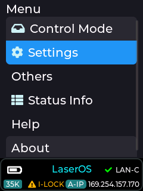 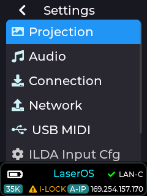 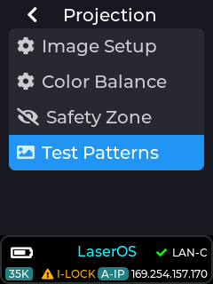

> By selecting one of the other control modes, such as Visualizer, the
> CubeOS stand-alone image settings are made available:

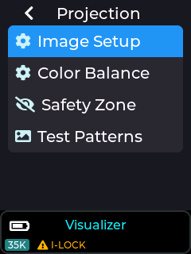

### Image Setup

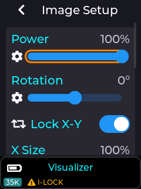 ****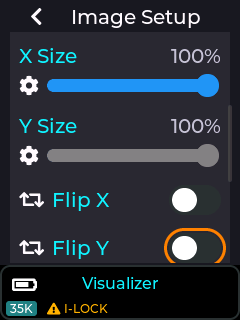 ****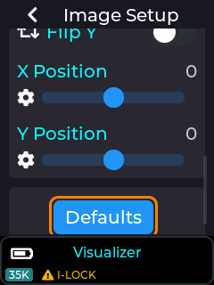

> Image power, rotation, X-size, Y-size, X-Flip, Y-Flip, X-Position and
> Y-Position are configurable. When X and Y size are at 100%, the
> position sliders have no effect as they cannot move the full-size
> image beyond the full-size projection area.

> The X and Y position sliders have a range of -128 to +128

> If the X and Y image size are reduced to 50%, then the X and Y
> position sliders will move the image with settings between -64 and +64

> A good way to get a feel for how the image size affects the amount of
> positional movement available, is to enable the RGB-THold test pattern
> (see Test Patterns below) then adjust image size and position in the
> Image Setup menu.

> 

### Colour Balance

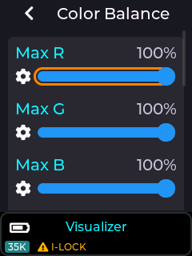 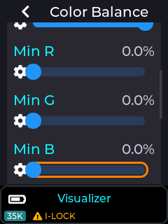 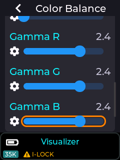

> Colour balance settings allow for fine adjustments of maximum and
> minimum outputs for each colour laser, plus the gamma curve for each.
> The default values should be adequate for most situations, but
> adjustments are available to allow for precise colour matching of
> multiple projectors.

### Safety Zone

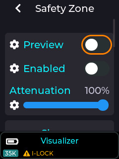 ****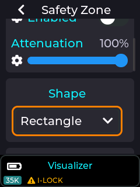 ****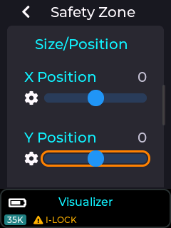 ****

****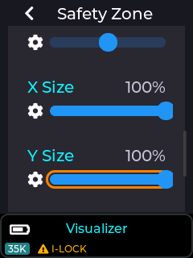 ****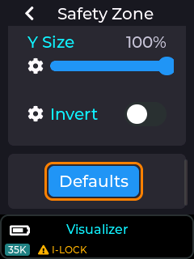

The Safety Zone setting, when enabled allows a basic shape to be created
for a keep within or keep out zone. The preview toggle (with Laser
Interlock Enabled) will project the outline of the safety zone.

By default, it is a keep-within zone and the projected preview colour is
green.

By setting the invert toggle, it becomes a keep-out zone and the
projected preview colour is red.

Whilst outside of a keep-within, or inside of a keep-out zone, the laser
power is reduced according to the attenuation setting. 100% attenuation
means that the out of zone beams are fully blanked. A 90% attenuation
would mean that the out of zone beams are reduced to 10% of their normal
power.

The Zone shape is selectable between Rectangle, Circle or Ellipse.

The size and position of the zone shape is adjustable using the
respective sliders.

The keep-within zone may be useful for defining a target area where the
beam may be safely terminated. The keep out zone may be useful for
excluding beams from an area when a camera or digital projector is
located.

Keep Within Safety Zone

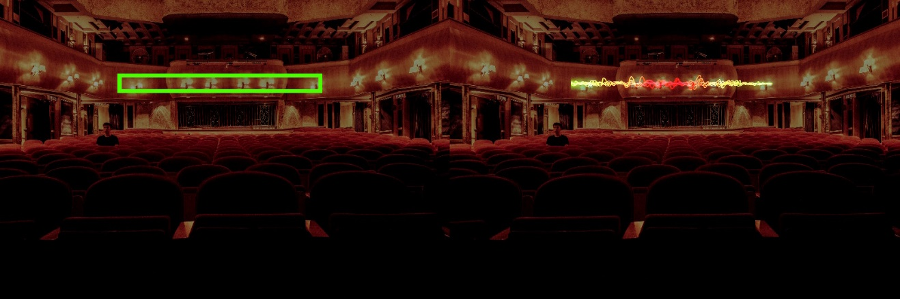

Keep Out Safety Zone

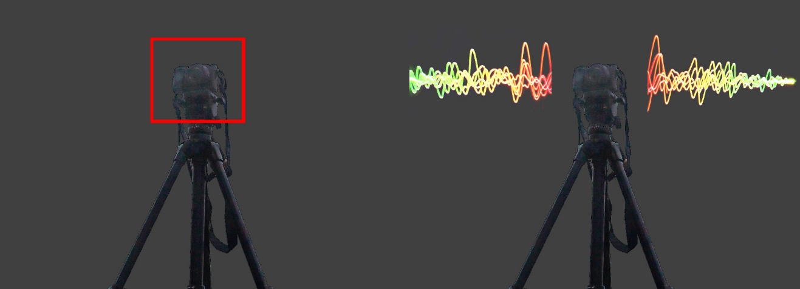

### Test Patterns

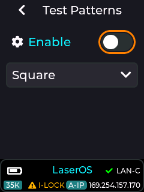 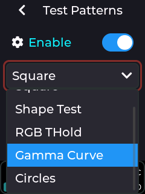

> The built-in test patterns are provided to verify correct operation of
> the lasers and the scanning system. The RGB Thold pattern is a low
> brightness one, used for factory setting of the internal laser diode
> driver. It can also be useful for setting up projectors on site as it
> has a border that shows the projected image size. Note that this is
> affected by the rotation, X-size, Y-size, X-Position and Y-Position
> sliders in Image Setup.

### 

## Mk2 Settings – Tempo

The tempo settings are used to control the speed of any enabled effects
applied to the projection (see MK2 effects wiki or in this guide here:
[Effects](#14.MK2 Built in Effects|outline)), e.g. The strobe effect
will flash faster as you increase the BPM slider in the tempo menu, and
flash slower when reducing the BPM slider.

The purpose of the tempo menu is mainly for live DJ effects while a
music track is playing.

In order for the supplied MK2 effects to work to the beat of a music
track you must first set the correct BPM, preferably using the tap BPM
feature, then use the sync button to mark which beat is the first beat
of a bar. Once this is done the MK2 effects will then be in sync with
any music that is playing allowing the user (with the aid of an APC40
MK2 MIDI controller) to perform live adjustments to the projection using
effects assigned to dials/faders on a MIDI controller.

The tempo menu can be accessed by going to Settings→Tempo when in either
playlist or visualizer control mode.

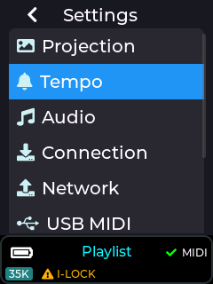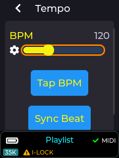

The tempo can be set using the BPM slider, or can be set using the “Tap
BPM” button.

Continuously pressing the “Tap BPM” button to the beat of any externally
playing music track will allow the MK2 to calculate the actual BPM of
the music.

The “Sync Beat” button will synchronize the beat to beat 1 of a 4 beat
bar.

The tempo parameters also also MIDI mapped to the dedicated tempo
buttons on an APC40 MK2 if using the factory supplied MIDI mappings.

Note: MK2 menu items in yellow (as shown in image above) mean they have
been MIDI mapped to a dial/fader on an external MIDI controller. They
will only show in yellow when a compatible MIDI controller is conn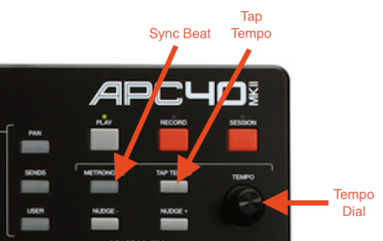ected to the USB port of the MK2.

## Mk2 Settings – Audio

Audio settings can be adjusted by going into Settings-\>Audio as shown
below:

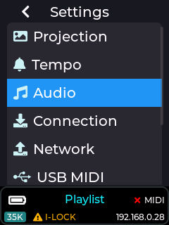

The audio settings allow changes to the audio output volume, audio
output delay, audio input selection, and input gain controls.

### Audio Output Volume

The audio output volume can be adjusted from 0 to 100%. This control
will adjust the current volume while a laser show is playing, and this
slider can be midi mapped to an APC MIDI controller.

This control will directly affect the audio coming out of the 3.5mm
audio connector on the rear of the MK2 labelled A-OUT (green connector)

Press on the menu knob to edit the slider and make adjustments, then
press again on the knob to exit and save this value (preserved through
power cycle).

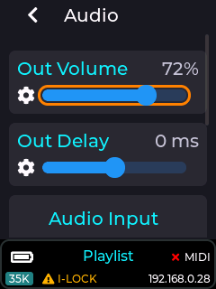To map the audio volume output
slider to a MIDI controller then ensure USB MIDI is enabled in
settings-\>USB MIDI and a compatible APC MIDI device is connected, then
single press the menu knob to enter slider edit mode (slider bar turns
orange), then long press again on the knob and a context menu will
appear allowing you to link this slider to a dial or fader over MIDI, or
unlink from an existing MIDI fader, or reset the slider to its default
value.

Note: The audio output volume slider comes pre-configured to a MIDI dial
on an APC40 MK2 if using the factory supplied SD card.

### Audio Output Delay

This slider allows the audio output to be either delayed, or started
earlier (with respect to a projection like when using the MK2 in laser
show mode) in order to compensate for any audio processing delay due any
extra audio processing present on the device connected to the line
output port of the MK2.

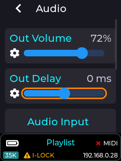

Example: Some portable amplified speakers have a DSP in order to provide
audio reactive light effects etc, and this can cause the audio going
into the unit to be delayed by as much as 300 milliseconds. This would
cause laser shows played on the MK2 to be completely out of sync with
the audio, so adjusting the out delay slider can compensate for this.

Note: Once a laser show on the MK2 has started, this slider will have no
affect on the audio output delay until you stop and start the laser show
again.

The audio settings also have no effect when using the MK2 in LaserOS
mode, as all audio is handled by LaserOS in this case.

### Audio Input Selection

This dropdown is used to change the audio input source used by the MK2,
and can be set to either the built in microphone or the stereo 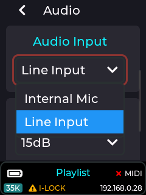line input connector.

The audio reactive visualizers and effects built into the MK2 will be
affected by this setting.

When line input is selected as the audio input source, you will need to
apply audio from a PC or other analog audio capable device via the 3.5mm
stereo jack to the rear of the unit labelled A-IN (pink connector).

### Max Line Gain / MAX MIC Gain

This dropdown allows the user to change the amount of gain that is
applied to the audio input source. Setting the gain too low here will
result in some audio reactive visualizers showing very little change.
Equally setting a too high gain will result in over driven visualizers.
Both inputs can have their gain adjusted from 0dB to 50dB in 5dB steps.

### 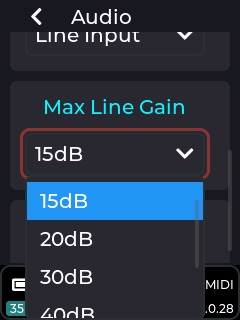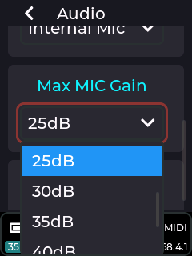

###  Audio Defaults

The entire audio settings can be reset to factory default values by
clicking this button and accepting the pop-up message box asking to
reset the values.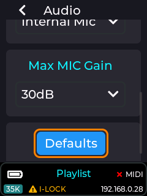

## 

## Mk2 Settings – Connection

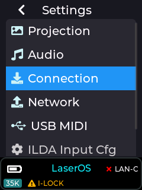 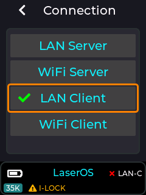

Select the connection type (required for control via LaserOS, ArtNet or
Liberation)

For multiple laser cubes and especially in areas where local WiFi may be
congested, we recommend using an Ethernet cable in LAN Client mode. When
set to LAN Client mode on a network without a DHCP server, the Laser
cubes will self-assign an APIPA address.

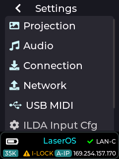

The tick by LAN-C indicates that the Mk2 Laser cube has connected in LAN
Client Mode.

The A-IP indicates that the IP address shown – 169.254.157.170 is an
AIPIPA one.

The Network settings can be customized under the [*Network
menu*](http://wiki.laseros.com/index.php/UltraMk2Network).

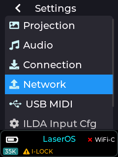 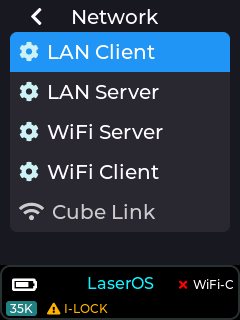

Note: If the connection mode is changed, the Mk2 Laser cube will need to
restart.

Move the red cursor to highlight “Yes” and push the rotary knob to
confirm.

#### APIPA mode explained

When using LAN client mode the MK2 laser cube will try to obtain an IP
address from a DHCP server on your network. If you have connected the
laser cube directly to your home router, or via an ethernet switch to
your home router then you will see that the laser cube will be given an
IP address according to your network (e.g. 192.168.x.x).

If you are not connecting the cube via a home router or DHCP server (due
to connecting a cable directly between PC/Mac/iOS and the MK2 laser
cube) then the MK2 will self assign itself an IP address using the Auto
IP protocol.

APIPA addresses start with 169.254.x.x.

If you are using Windows or an Apple MacBook then the following should
be done in order to connect with our LaserOS software using APIPA:

1.  Temporarily turn off WiFi on your PC/MacBook
2.  ensure LaserOS is not running, and close it if it is.
3.  Turn on your MK2 laser cube and connect an ethernet cable from the
    LAN port on the cube to the LAN port on your PC/macBook.
4.  Wait until the laser cube self assign’s an APIPA address.
5.  Start LaserOS on your macBook and check that the MK2 is detected
    (Laser ON button in the top right corner of LaserOS software should
    NOT be greyed out).
6.  Turn your PC/MacBook WiFi back on if you need internet access.

## Mk2 Settings – Network

 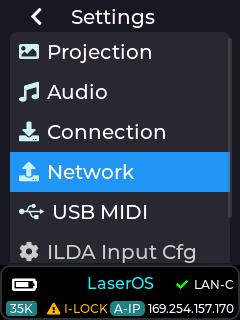

### LAN Client Mode

For multiple laser cubes and especially in areas where local WiFi may be
congested, this is the recommended connection mode. When connected to a
network without a DHCP server, the Laser cubes will self-assign APIPA
addresses.

####  LAN Client Mode Customisations

IP (Address) Mode - Auto IP / Static IP

Auto mode. Uses DHCP server if present, or AIPIPA.

Static IP. Manual configuration of IP Address, Net Mask and Gateway

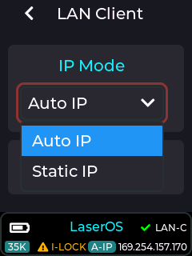 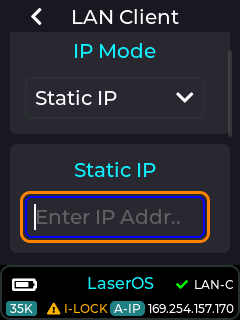 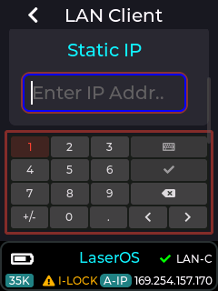 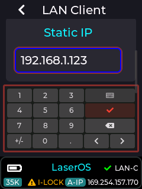

To enter the IP address, short press with the entry box highlighted.

Select the tick button to close the entry box.

The gateway address and subnet mask can be edited in the same way.

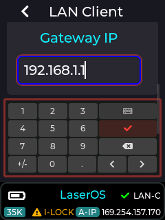 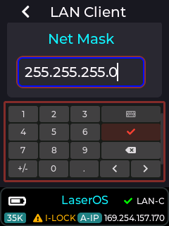

### 

### LAN Server Mode

This is not recommended, and in most cases LAN Client Mode’s AIPIPA will
be far easier to implement, however it is retained for most flexibility.

####  LAN Server Mode Customisations

Manual configuration of IP Address and Net Mask

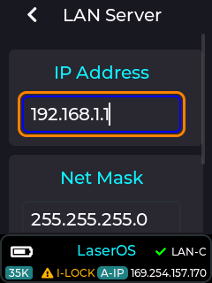

### WiFi Server Mode

Useful for cable free, single cube LaserOS operation in areas with no
WiFi congestion.

Note: Make sure you connect the provided WiFi Antenna before using any
wireless modes.

It is preferable to leave the WiFI channel set to Auto, which will make
the device scan for the quietest WiFI channel to use at each power on of
the device.

####  WiFi Server Mode Customisations

SSID, Password, Channel (including Auto), Bandwidth, IP Address, Net
Mask

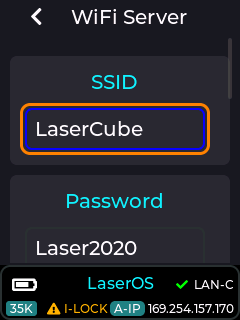 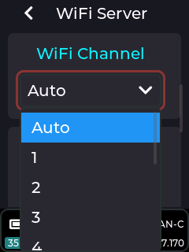 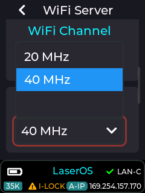

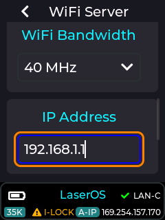 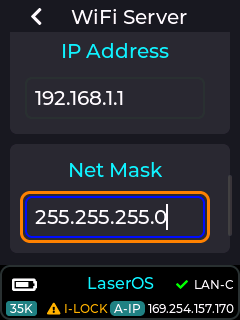

### 

### WiFi Client Mode

For connecting to an existing WiFi router. Performance may vary
depending on the quality of the router, amount of WiFi congestion and
the amount of existing network traffic.

Note: Make sure you connect the provided WiFi Antenna before using any
wireless modes.

#### WiFi Client Mode Customisations

SSID, Password, IP Mode - Auto / Static (IP Address, Gateway, Net Mask)

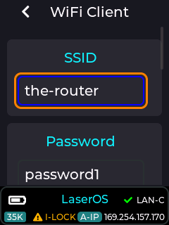 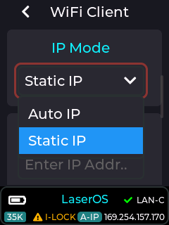

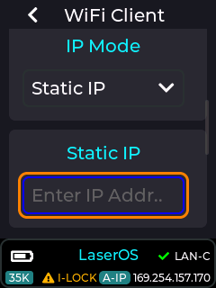 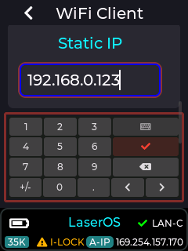 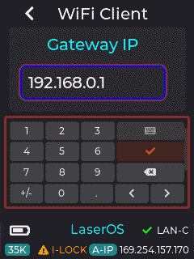 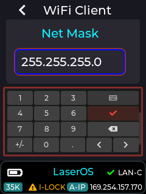

To enter the IP address, short press with the entry box highlighted.

Select the tick button to close the entry box.

### 

### Cube Link Mode

Wireless Cube Link (only available when connection mode is not set to
WiFi) is a method of synchronising playback of content across multiple
Mk2 Laser cubes. Cube Link does not require a WiFI network to be present
as it creates its own wireless network to communicate between master and
slave devices within ~20-40m line-of-sight range using a low data rate
communication protocol.

Note: Make sure you connect the provided WiFi Antenna before using any
wireless modes.

In order to set up a Cube Link network, it must be enabled on each Mk2
Laser cube, then one Mk2 Laser cube must be set to Master, and the other
Mk2 Laser cubes as Slaves. To exist on the same Cube Link Network, they
must all share the same Link Channel and Link Pin. The Group determines
what content that particular Mk2 Laser cube will project. For a 2
projector Laser show, the first projector content will be shown on all
Mk2 Laser cubes set to Group 1 and the second projector content will be
shown on all Mk2 Laser cubes set to group 2.

Slave devices that are in range of a Master that have a matching channel
and pin configuration will be indicated by the status bar background on
each slave turning from black to purple.

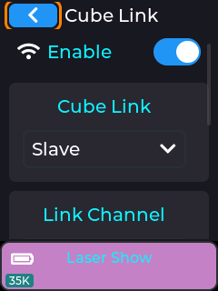

#### Cube Link Mode Customisations

Enable, Master/Slave, Link Channel, PIN, Group

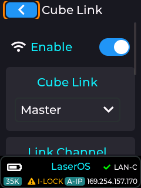 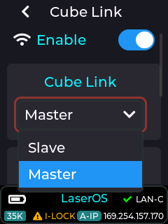 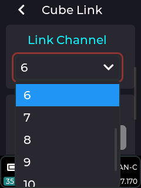

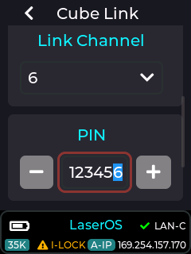 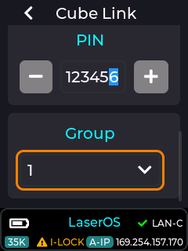

> To set the PIN, either use the + and – buttons to increase / decrease
> the selected digit, highlighted in blue, or short press with the PIN
> entry box highlighted.

> When in the PIN entry box:

>  Short press to change the highlighted digit.

>  Rotate the knob to increase/decrease the highlighted digit

>  Long press to exit the PIN entry box.

## Mk2 Settings – USB MIDI

In order to use any of these MIDI devices, the USB must be enabled by
going to the Settings -\>USB MIDI menu.

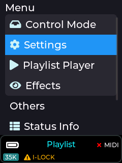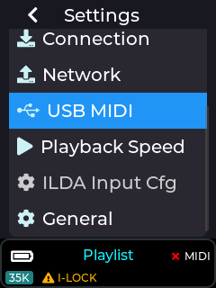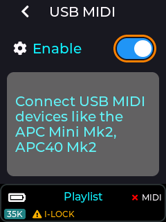

Note: USB MIDI does **NOT** operate when the unit is in LaserOS / ArtNet
/ DMX control modes, as these modes ar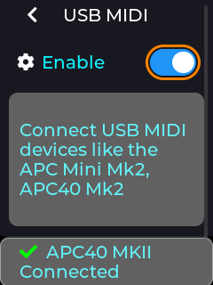e controlled using alternate
communication protocols.

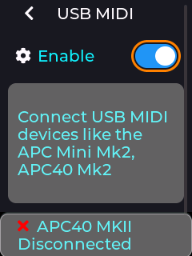

If a compatible device is detected on the MK2 USB port then the status
bar will briefly show an updated connected status, and unplugging a
device will show the disconnected status as shown above. The status bar
will also show a green tick or a cross next to the MIDI label on the RHS
of the status bar.

## Mk2 Settings – Playback Speed

The user can adjust the playback speed of any CUE being projected while
in the playlist control mode.

This can be done using the Settings→Playback Speed menu

The playback speed slider can also be assigned to a MIDI knob or fader
if using an APC40 MK2 or APC mini MK2 (see [MIDI
Mapping](#16.MIDI Mapping using an APC40 MK II or APC Mini MK II|outline)
in this guide, or the online wiki).

## Mk2 Settings – General

This menu has the option to change the LCD brightness and also an option
to enable backward compatibility with original WiFi cubes while using
LaserOS.

Note: The backward compatibility option will only need to be enabled if
you intend to use a mix of old WiFi cubes and new MK2 laser cubes on the
same network with LaserOS (you will also need LaserOS version \>=
v0.17.7).

## **MK2 Settings – ILDA Input Cfg**

The parameters set in the ILDA Input Configuration menu are valid when
an external DAC is connected to the ILDA input connector on the back of
the MK2. With no ILDA cable connected, this item will be greyed out on
the MK2 menu UI.

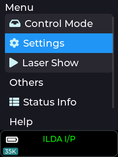 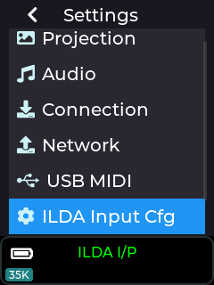

When an external DAC is connected via the ILDA input connector, an
additional menu item is available under Settings – ILDA Input Cfg.

This is for digitally tuning the Laser Diode Driver to compensate for
any errors in the third-party DAC hardware. One common problem is “ghost
beams” where one or more channels of the ILDA colour signals have a
small voltage present on the output pins when those channels are meant
to be off (blanked).

The In Mute R, G and B levels allow a threshold to be set, below which
the beams are forced to be off. For example, a DAC with a higher than
normal “zero output voltage” on the green channel could cause a faint
green beam to always be emitted, regardless of any master brightness
setting in the controller software for that DAC. The ILDA Input Cfg -\>
“In Mute G” level could be raised until the green ghost beam is
extinguished.

There being an increased offset on the green channel would also affect
the colour balance at low intensities. To compensate, the ILDA Input Cfg
–\> “Diode th G” could be reduced until the correct colour balance is
restored. This allows errors from external DACs to be tuned out.

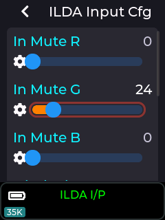 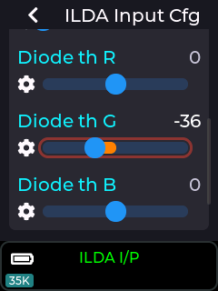

# MK2 Built in Effects

The effects menu will be available on the top level menu of the MK2 when
it is in either playlist or visualizer control mode.

The effects can be used to modify the currently projected image, and
consist of both colour modifying effects and image movement / scale
effects.

These effects are also dependant on the current setting of the tempo
which can be accessed from settings→tempo or set using tap tempo an an
APC40 MK2 device (see wiki section on
[tempo](#14.2.Mk2 Settings – Tempo|outline)).

Any of the effect parameters can be MIDI mapped to an APC40 MK2 or APC
mini MK2 in order to allow live modification of the effects (see our
DEMO APC40 MK2 MIDI mapping on the SD card provided with the MK2).

Note: Some effect parameters like “Force On” are intended to be MIDI
mapped only, and are used for live effect activation using an APC40 MK2
/ APC mini MK2 MIDI device.

The Effects menu can be accessed from the top level menu when the MK2 is
in playlist or visualizer control mode as shown in the image below:

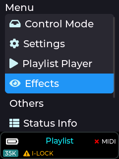

In order to be able to use the effects they must be enabled. If no
effects are required then it is recommended to have the effects disabled
to prevent unintentional changes to the projection.

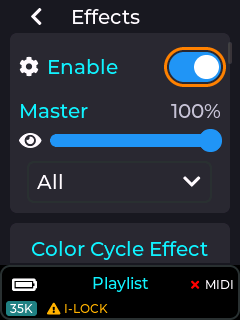

Any of the effect parameters changed via the LCD menu UI will be
preserved through a power cycle. This is to allow the unit to start up
with any effect chosen by the user without any additional actions which
is perfect for when the device just needs to be powered on and interlock
activated.

### 

### Available Effects

There are currently 6 effects that can be applied to the currently
projected image, and each effect has its own set of user adjustable
parameters depending on the chosen effect.

- Colour Cycle
- Zoom
- Hue
- Colourize
- Flash
- Strobe

More effects will be added in future firmware releases for the MK2,
allowing for more varied live projection modifications.

#### Master Effect slider

The intensity applied to the projection from any of the available
effects are controlled by a master intensity slider. This is set to 100%
by default, and can be changed via the menu UI or MIDI mapped to a
dial/fader. With this slider at 0% then none of the effects will be
applied to the projection.

Note: The default MIDI mapping provided with the factory SD card for an
APC40 MK2 has the main effect intensity slider mapped to the APC40 MK2
Master fader, and must be moved to a value \>0% for any effects to be
applied,

#### Effects Filter drop down

In order to access the required effect filter more quickly via the menu
UI, the user can use the effect filter drop down. By default the effect
filter is set to “ALL” so all filters can be accessed by scrolling
through the effect menu. If a specific effect filter is selected then
only the parameters for that effect will be visible.

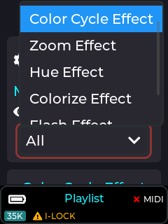*Note: The effect filter is only
for filtering effects in the UI to allow faster config of the chosen
effect, but does not have any bearing on which effects are activated.*

### 

### Colour Cycle effect

This effect will cycle through a series of primary colours to the
current beat or multiple of the beat based on the current tempo and
effect speed setting (tempo can be set via settings→tempo menu).

The colour sequence is currently fixed to the following:

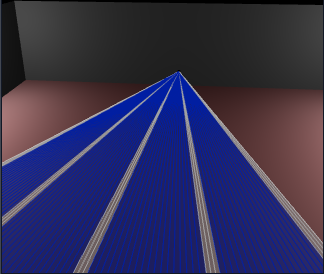Blue → Green → Cyan → Red →
Magenta → Yellow

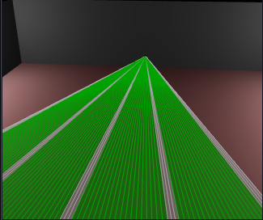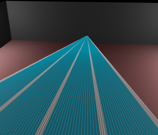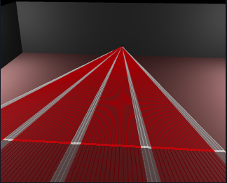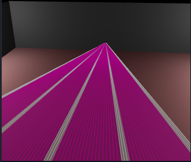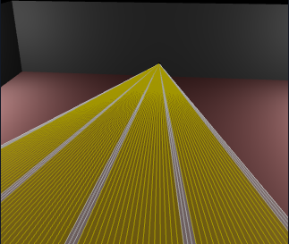The above images show the colour
cycle effect colours when +White parameter is OFF.

#### 

#### Colour cycle effect parameters

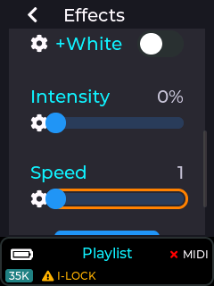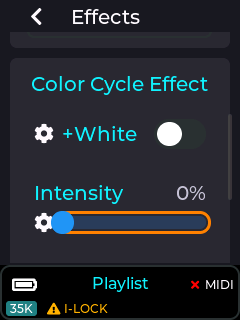

The adjustable parameters for the colour cycle effect are Intensity,
Speed, and Include White (+white).

Intensity parameter is used to select how much of the original CUE
colour is modified by this effect. e.g. 50% intensity will equally mix
the original CUE colour with the cycle effect colour, and 100% will
completely replace the original CUE colours with the colour from this
effect.

These parameters can be MIDI mapped to a dial/fader when using an APC
MIDI device.

Speed parameter is used to control how often the colour cycle occurs.
With a speed of 1, the colour will change on every beat, and a speed of
2 will change on every other beat etc.

The “Force On” button is only present so it can be assigned to an APC
MIDI button in order to live trigger the effect, overriding the
intensity slider. Pressing an APC button mapped to this button will
cause the intensity to be briefly set to 100% while the button is held
down.

The +White parameter is used to control whether any parts of the
currently projected CUE which contains full white will be overridden by
the cycle colour.

The +White parameter is useful when using fan beam patterns as shown
below.

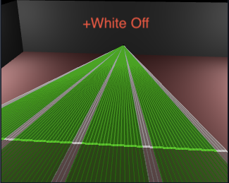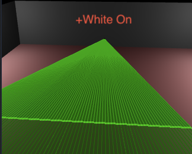

With +White off, only non white parts of the beam pattern will be
replaced by the cycle effect colour. With +White On, the whole beam
pattern will be re-coloured.

#### Default APC40 MK2 Colour Cycle Effect MIDI mapping

The image below shows how this effect is mapped to an APC40 MK2 when
using our default MIDI mapping provided on the SD card shipped with the
MK2.

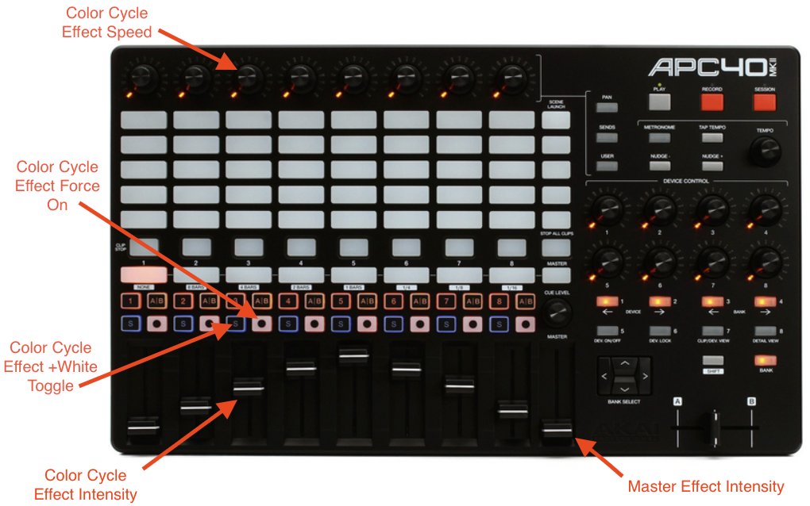

### Zoom Effect

This effect will zoom the projection in/out in sync with the beat based
on the current tempo (see [tempo](#14.2.Mk2 Settings – Tempo|outline) in
the wiki).

#### Zoom effect parameters

The zoom effect has several parameters that can be adjusted by the user,
including intensity, speed, and zoom type.

The intensity slider adjusts how much of the zoom in/out effect is
applied to the current projection between 0% and 100%.

The Speed slider allows the rate of zoom in/out to be adjusted. This
parameter is based on the current tempo, and can be adjusted between
fractions of the current beat to multiples of the beat.

The Linear parameter changes whether the zoom in/out is done in a linear
fashion or a logarithmic one.

The “Force On” button is intended to be MIDI mapped to an APC button for
live activation of the effect. When this button is activated, the
intensity slider is briefly changed to 100% while the button is held
down, and then returns to its previous value once released.

#### Default APC40 MK2 Zoom Effect MIDI mapping

The image below shows how this effect is mapped to an APC40 MK2 when
using our default MIDI mapping provided on the SD card shipped with the
MK2.

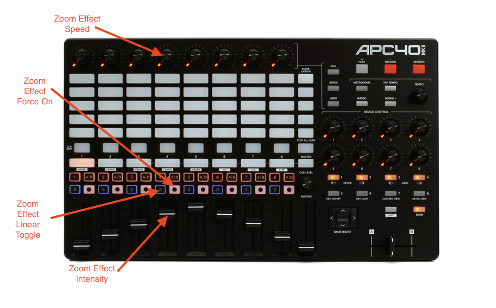

### 

### Hue Effect

This effect will re-colour the current projection to a user selected
colour based on the hue, saturation, and intensity parameter
adjustments.

#### Hue effect parameters

The images below show the available user parameters for the hue effect.

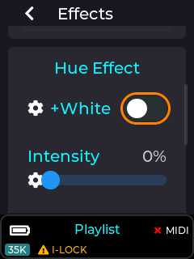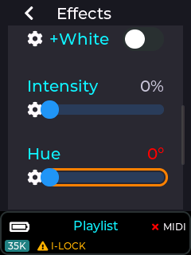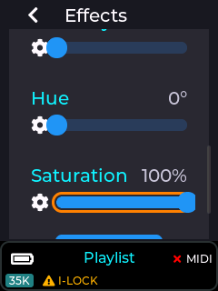

The “+White” works the same as described in the Colour cycle effect
documented previously, and determines whether white portions of the
projection will include the colour override or not.

The intensity slider determines how much of the selected hue colour will
be applied to the projection.

The saturation slider will set how vivid the colour will be, so a low
saturation level will result in pastel colours, and a high saturation
will give the most vivid colours.

The hue slider allows a colour to be selected within the hue range of 0
to 360 degrees as shown in the image below.

The “Force On” button is intended to be MIDI mapped to an APC button for
live activation of the effect. When this button is activated, the
intensity slider is briefly changed to 100% while the button is held
down (fully activating the hue effect), and then returns to its previous
value once released.

Note: Any effect parameters adjusted via the MK2 LCD menu UI will be
preserved through a power cycle, but any adjustments made via a
connected APC MIDI device will not. If an APC40 Mk2 is attached to the
MK2 then any dials assigned to an effect or other device setting will
indicate the current power on value using the associated APC LED ring.
Absolute faders will always override any effect slider value set in the
menu UI, since Faders have a finite start and end position.

#### 

#### Default APC40 MK2 Hue Effect MIDI mapping

The image below shows how the hue effect is mapped to an APC40 MK2 when
using our default MIDI mapping provided on the SD card shipped with the
MK2.

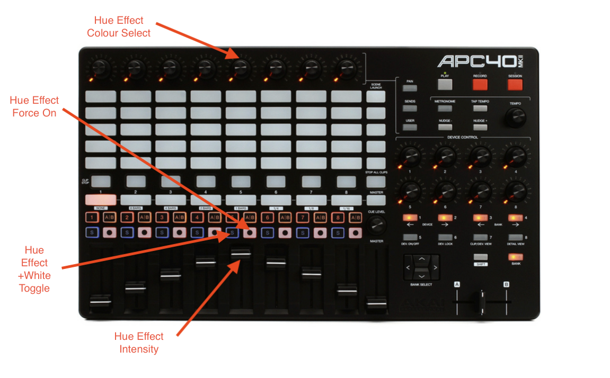

### Colourize Effect

This effect will apply a rotating colour hue on the projection.

The left image is without the
effect applied, and the right with the effect applied.

#### Colourize effect parameters

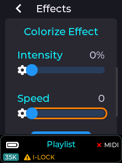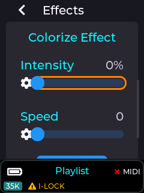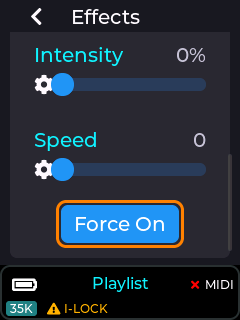

The intensity parameter determines how much of the colour effect will be
applied to the projection between 0% and 100%.

The speed parameter changes the rate at which the colour moves, and is
not related to the current tempo setting.

The “Force On” button is intended to be MIDI mapped to an APC button for
live activation of the effect. When this button is activated, the
intensity slider is briefly changed to 100% while the button is held
down (fully activating the colourize effect), and then returns to its
previous value once released.

#### Default APC40 MK2 Colourize Effect MIDI mapping

The image below shows how the colourize effect is mapped to an APC40 MK2
when using our default MIDI mapping provided on the SD card shipped with
the MK2.

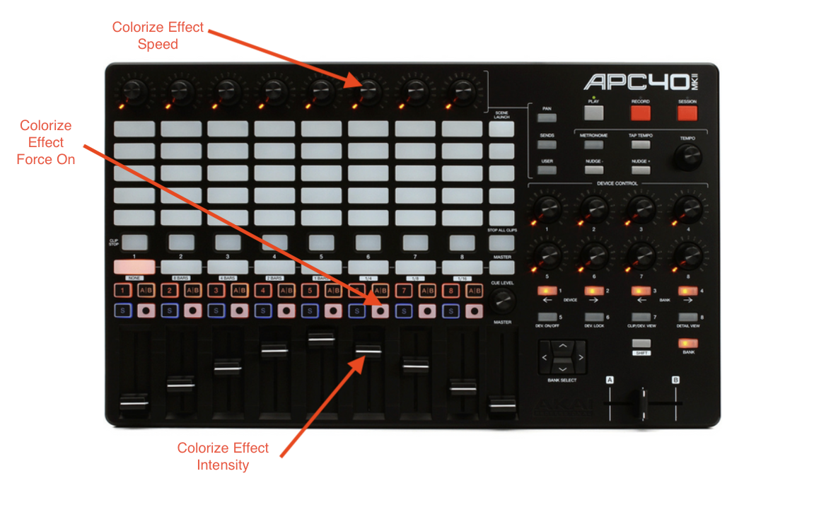

### Flash Effect

The flash effect will fade the current projection in/out to the beat or
multiple of the current beat, based on the current tempo.

#### Flash effect parameters

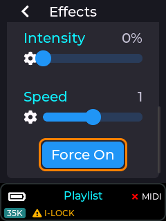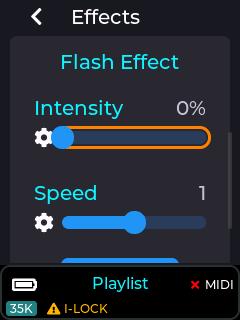

The intensity parameter determines how much of the projection will have
the flash fade applied, and is between 0% and 100%.

The speed parameter changes the rate at which the projection is faded
in/out, and is linked to the current tempo, and synced to the beat.

The “Force On” button is intended to be MIDI mapped to an APC button for
live activation of the effect. When this button is activated, the
intensity slider is briefly changed to 100% while the button is held
down (fully activating the flash effect), and then returns to its
previous value once released.

#### Default APC40 MK2 Flash Effect MIDI mapping

The image below shows how the flash effect is mapped to an APC40 MK2
when using our default MIDI mapping provided on the SD card shipped with
the MK2.

### 

### Strobe Effect

The strobe effect will strobe the current projection on/off to the beat,
fraction of the beat, or multiple of the current beat, based on the
current tempo (see wiki for [tempo](#14.2.Mk2 Settings – Tempo|outline)
menu).

#### Strobe effect parameters

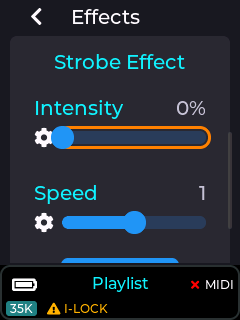

The intensity parameter determines the amount the projection will have
the strobe applied, and is between 0% and 100%.

The speed parameter changes the rate at which the projection is strobed,
and is linked to the current tempo, and synced to the beat.

The “Force On” button is intended to be MIDI mapped to an APC button for
live activation of the effect. When this button is activated, the
intensity slider is briefly changed to 100% while the button is held
down (fully activating the strobe effect), and then returns to its
previous value once released.

#### Default APC40 MK2 Strobe Effect MIDI mapping

The image below shows how the strobe effect is mapped to an APC40 MK2
when using our default MIDI mapping provided on the SD card shipped with
the MK2.

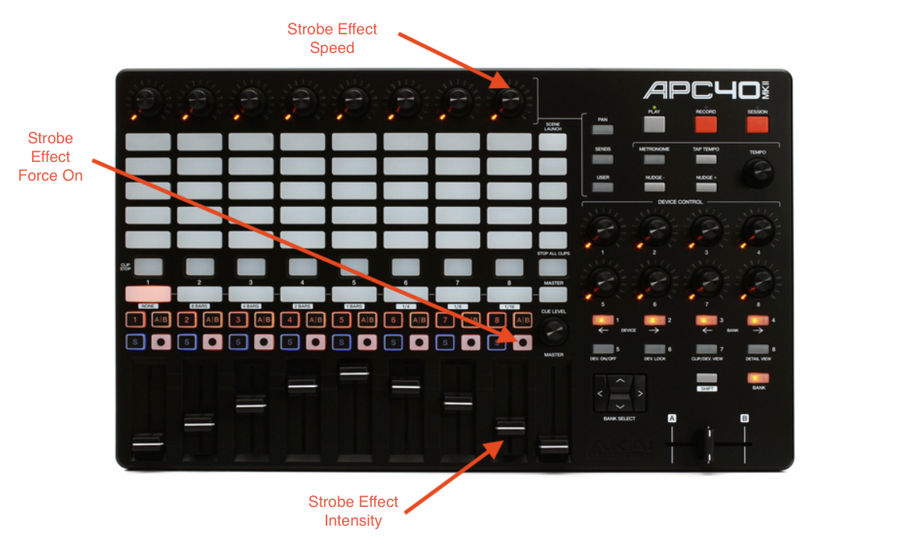

# Status Info Page

The Status Information menu provides info about the current
hardware/network status. It is useful when info like SD card free status
or buffering status need to be checked by the user.

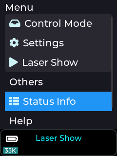 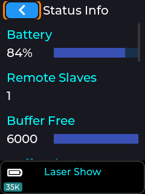

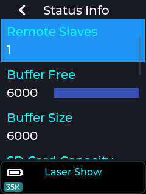 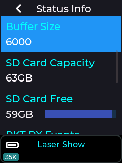 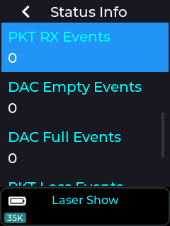 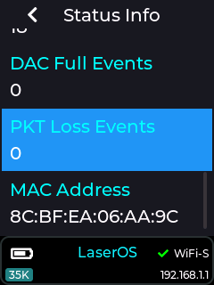

> **Battery:** The Battery gauge shows an estimation of battery state of
> charge, based on measuring its voltage. If projecting, the reading
> will move around under load, showing a slightly lower reading as the
> scan complexity / output power varies.

Whilst charging, the battery state of charge cannot be measured.

**Remote Slaves:** If using Cube Link, gives the number of connected
slave devices.

**Buffer Free:** displays the current buffer space available.

**Buffer Size:** displays the maximum buffer level.

**SD Card Capacity:** shows the reported capacity of the SD Card in
Gigabytes

**SD Card Free:** shows the remaining capacity of the SD Card in
Gigabytes

> **PKT RX Events:** shows the number of received packets. When in
> LaserOS Control Mode, this will increase rapidly as each packet of
> projection data is received.

> Clicking on this entry will reset the
> count to zero.

> 

>  src="ULTRA_MK2_Full_Manual_v1-3/Pictures/10000000000000F000000140A08DC84B.png"
> style="width:3.649cm;height:4.867cm" />  src="ULTRA_MK2_Full_Manual_v1-3/Pictures/10000000000000F000000140E7CC16F7.png"
> style="width:3.634cm;height:4.845cm" />

> 

> **DAC Empty Events:** displays the number
> of buffer under-run events.

> This can happen due to lost packets, disabling the interlock or
> selecting the test patterns. Clicking on this entry will reset the
> count to zero.

> 

> **DAC Full Events:** displays the number of buffer overflow events.

> Clicking on this entry will reset the count to zero.

> 

> **PKT Loss Events:** displays the number of lost packets. Lost UDP
> packets are common when using WiFi, especially in “congested” areas
> with many competing devices. Lost packets will be give the symptom of
> brief and intermittent drop-outs of the projection.

> Moving away from the WiFi congested area, or preferably using a wired
> Ethernet connection will minimize this. Clicking on this entry will
> reset the count to zero.

> 

> **MAC Address:** MAC Address, unique to each Ultra Mk2 laser cube.

> 

# MIDI Mapping using an APC40 MK II or APC Mini MK II

The Ultra MK2 is capable of being controlled directly using an APC 40
MK2 or an APC mini MK2 (others will be added TBD.) connected to the USB
port on the rear of the unit.

In order for any MIDI mapping to be saved, an SD card must be inserted
with the correct path to the settings folder present on the card. The
MIDI mapping files saved to the card are located here:
***/Laser****c****ube/settings***

Separate mapping files are saved for each MIDI device type, and also for
each MK2 control mode.

The MIDI mapping files are also saved in JSON file format which is human
readable text, so the user can also edit these files manually using a
text editor if required.

### Enabling USB MIDI

In order to use any of these MIDI devices, the USB must be enabled by
going to the Settings -\>USB MIDI menu.

Note: USB MIDI does **NOT** operate when the unit is in LaserOS / ArtNet
/ DMX control modes, as these modes are controlled using alternate
communication protocols.

If a compatible device is detected on the MK2 USB port then the status
bar will briefly show an updated connected status, and unplugging a
device will show the disconnected status as shown above. The status bar
will also show a green tick or a cross next to the MIDI label on the RHS
of the status bar.

### MIDI Mapping a Slider Control

To map a slider in the menu to an APC dial or fader control, single
press on a slider to enter edit mode, then long press to bring up the
context menu, and then select “Link MIDI Knob” as shown below.

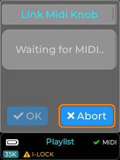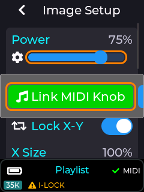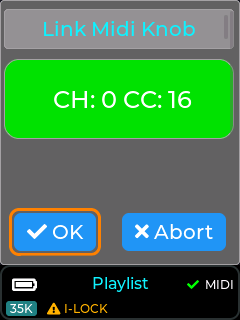

Once “Link MIDI knob” is selected, the MK2 will wait for the user to
turn or move a control on the APC. Once a control is moved then the
associated MIDI channel and CC number will be captured.

If the MIDI channel and CC chosen by the user is already assigned to
another control then the MIDI info will be shown in orange instead of
green.

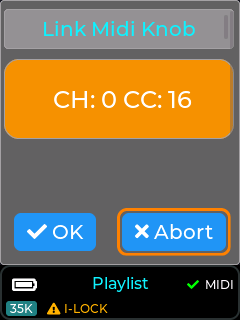

If the user accepts this APC control while the MIDI status is orange,
the previous function will be un-mapped and re-assigned to the current
UI slider.

Almost all sliders in the MK2’s menu UI can be assigned to an external
APC Dial or Fader.

Note: Faders on an APC40 are absolute controls and will always override
the MK2 slider value when moved, unlike APC dials which are relative
adjustment control with no physical end stops.

Once a slider from the MK2’s menu UI has been assigned to an APC
control, the menu UI will update its slider to a yellow colour instead
of blue as shown in the image below. Any movement of the assigned APC
control will now also move the slider on the MK2 menu.

If the slider was assigned to a dial on the APC40 MK2 then the LED ring
on the APC dial will also reflect the slider’s current value, and
editing the slider on the MK2 menu UI will also update the APC’s led
ring as they are always kept in sync with each other.

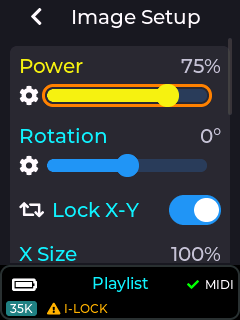

The image below shows how an APC dial will look once mapped to a MK2
slider element.

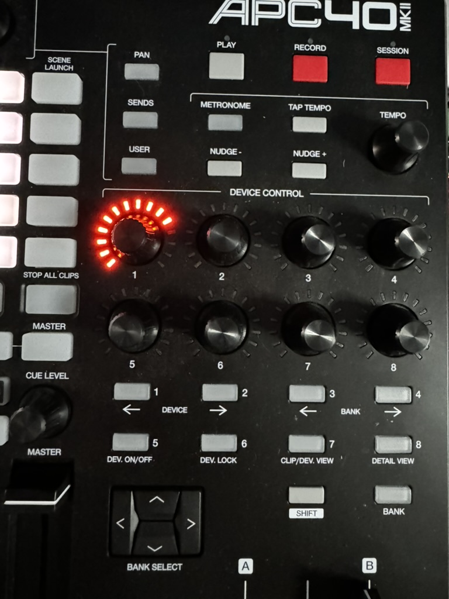

Note: When an APC dial is un-linked from a MK2 UI element, the LED ring
will go off.

### Un-mapping a Slider Control

To remove a previous MIDI mapping from a slider in the MK2 menu UI, edit
the control by short press on the slider to enter edit mode, then long
press to bring up the context menu, then select “unlink MIDI Knob”
option.

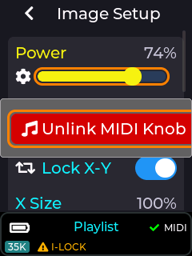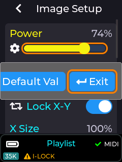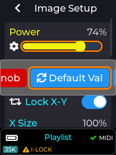

The images above show all the options available on the slider pop-up
context menu, including the un-link option. The “Default Val” button
will return the currently edited slider to its factory power-on default
value, and the “Exit” button closes the context menu without performing
any other actions.

Once the unlink option has been selected on the context menu, the
control will return back to a blue colour indicating that it is no
longer associated with any external MIDI control.

### MIDI Mapping a Button Control or Switch

Buttons and Switch elements in the menu UI can also be mapped to an APC
button by highlighting the element on the MK2 menu UI, and then long
pressing to activate the context menu. Once the context menu is
activated you can select the “Link MIDI note” option, then press a
control on the connected APC, and then assign a LED colour using the
colour drop down. Un-Linking is done by long pressing on a UI element
and selecting “Unlink” from the context menu.

MIDI mapped buttons / switches will also show in yellow on the LCD
instead of a blue colour.

The images below show the MK2 in playlist control mode with it’s play
button MIDI mapped to an APC button. If the APC button selected has an
RGB LED associated with it then the button will l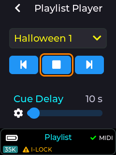ight up on the APC with the
colour selected from the colour dropdown.

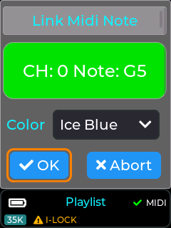

### 

### MIDI Mapping a Drop Down control

Most of the drop down UI controls within the MK2 menu UI can be linked
to a button on a connected APC MIDI controller. These include the
currently selected playlist drop down, and also the laser show drop down
when in laser show control mode.

To MIDI map a drop down you will firstly need to select an item from the
drop down that you wish to assign to an APC button, then long press on
the drop down in order to bring up the context menu.

Once the context menu is visible you will be able to assign the
currently selected item from the drop down to a button on the APC using
the “Link MIDI Note” button. Previously linked items can also be
un-linked using the same procedure of selecting the drop down item and
then long pressing to bring up the context menu, followed by selecting
the “UnLink MIDI Note” option.

With an APC40 or APC Mini connected, there are a total of 15 different
colours selectable during the MIDI mapping process.

Note: Some APC buttons do not contain an RGB LED, so consult the
relevant documentation for your APC device to determine which APC
buttons can have an RGB colour assigned. If an APC button only has a
single LED colour, then only select the first colour from the colour
drop down.

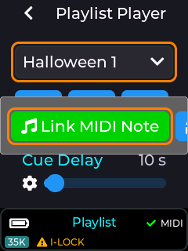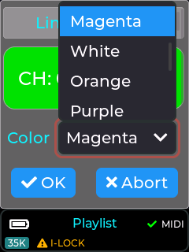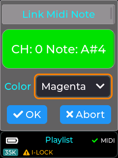

The drop down UI element will now be shown in yellow, indicating a
mapping to an APC button, and the APC button (top right) will change to
the selected colour (Magenta in this example).

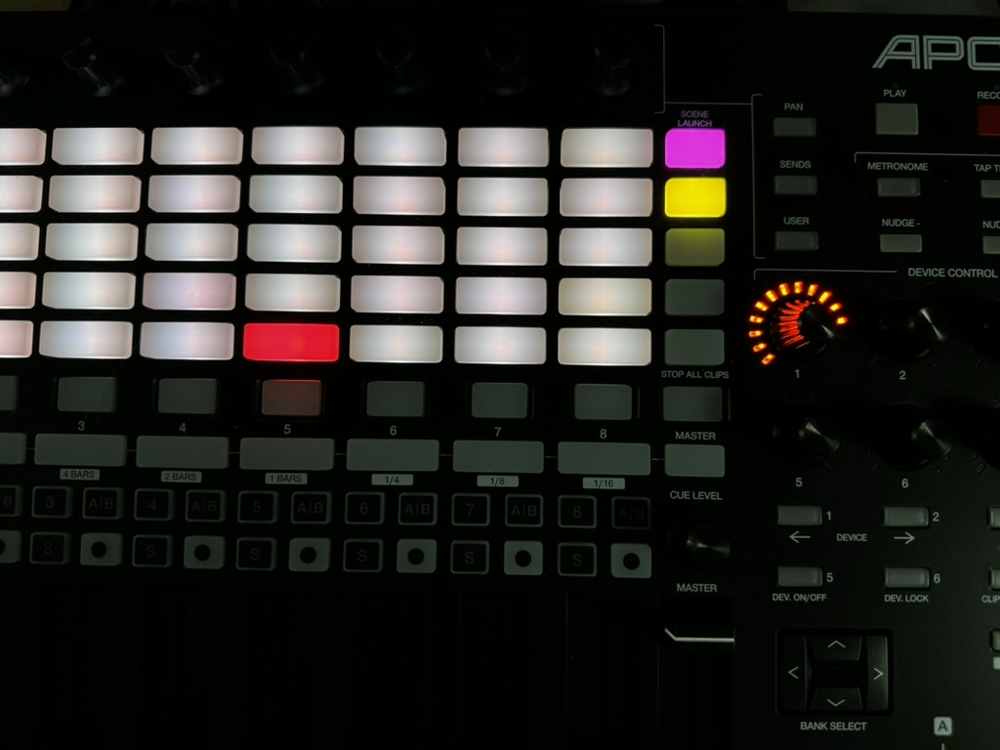

### Default APC40 MK2 MIDI mapping

The default MIDI mapping for an APC40 MK2 is shown below, and is
provided with the factory SD card image.

This mapping can be changed by the user if required using this guide.

Items in blue are relevant when in playlist control mode, and items in
red are part of the effects provided when in playlist or visualizer
control mode, and items in yellow are global device adjustments linked
to items within Settings→Projection→Image Setup.

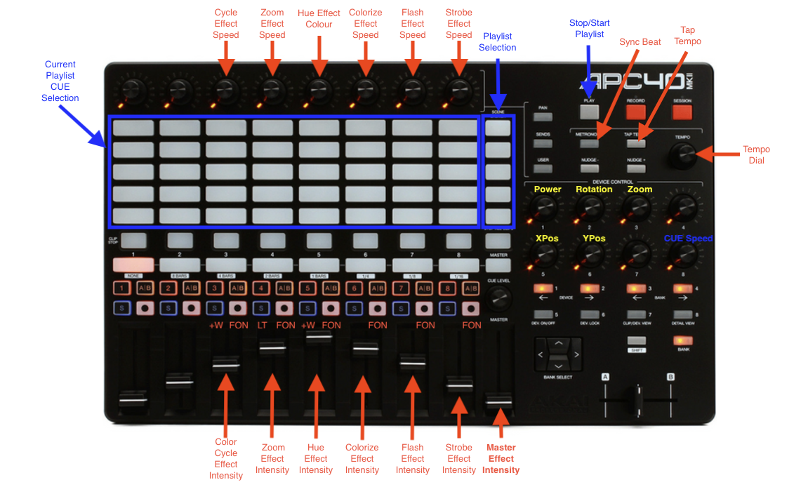

> 

# LaserCube Web Admin Page

The Laser cube has a legacy Web Admin Page for adjusting some of the MK2
network based configuration settings and also performing remote firmware
updates.

1\. Note the IP address from the bottom right corner of the LCD.

2\. Open a web browser and type in that same IP address.

Log in using the following credentials:

User Name: **LaserCubeUser**

Password: **Laser2020**

The Web Admin Page has 3 Menu sections:

- [**H**](#_y7yarf9ho2l)**ome Menu**, showing general info.
- **Config Menu**, for Network and mode settings.
- **Update Menu**[, for performing remote firmware
  update](#_sortqr24vwrb)s.

#### 

## Home Menu

The Home Menu shows the Model Name, Interlock type, firmware version and
Firmware Active Partition. There are 2 partitions to allow fall back to
a good working state should an update fail or be interrupted.

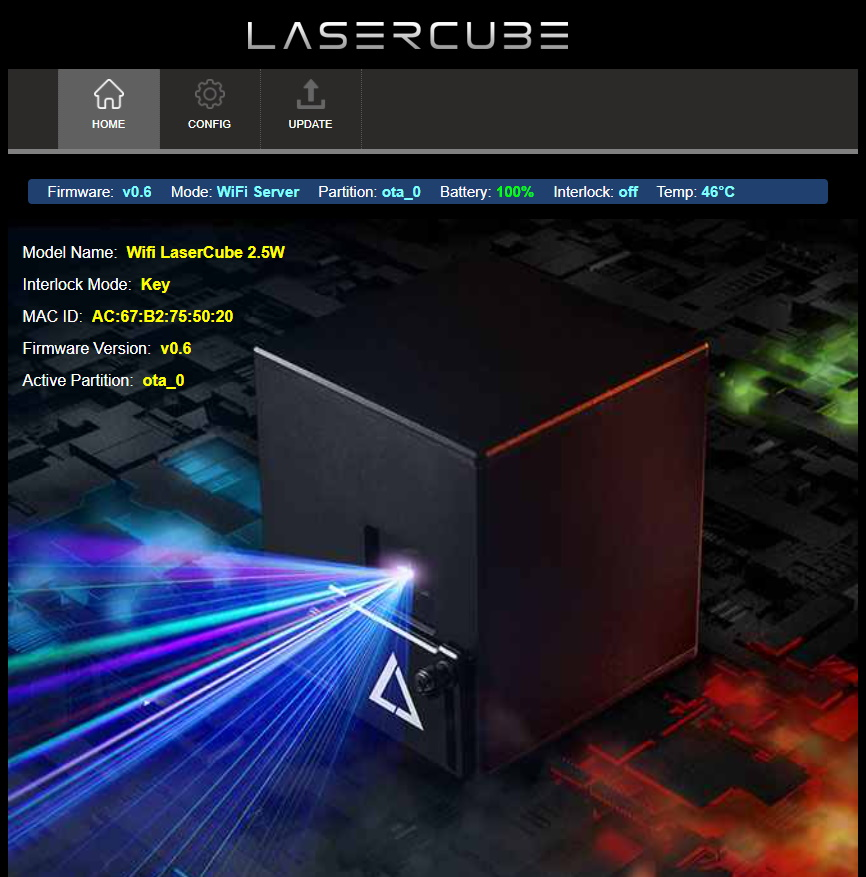

## Config Menu

The Config Menu has 3 tabs, for network set-up and mode selection:

- **WiFi Tab**, for Wireless ConnectionSettings
- **LAN Tab**, for Wired Connection Settings
- **General Tab**, for Connection Mode Selection

### WiFi Tab

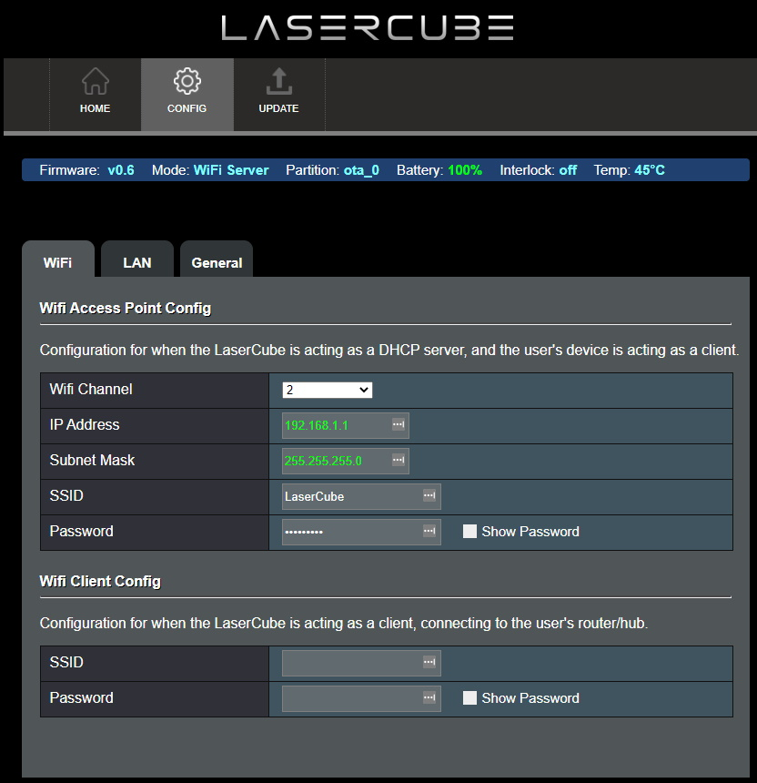

Where WiFi interference is present, the LaserCubeWiFi channel can be
changed.

The IP address and Subnet can be set for when the LaserCube is operating
in WiFi Server mode, where it provides a DHCP service.

The WiFi Server mode default SSID and Password can also be changed.

If connecting to a router in WiFi Client mode, the SSID and WiFi
password can be entered directly. This is useful if the router does not
support WPS.

##### 

### LAN Tab

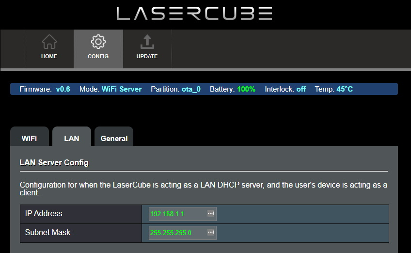

The IP address and subnet can be set for when the LaserCube is operating
in LAN Server mode, where it provides a DHCP service. LAN Client (with
APIPA is preferred though.)

### General Tab

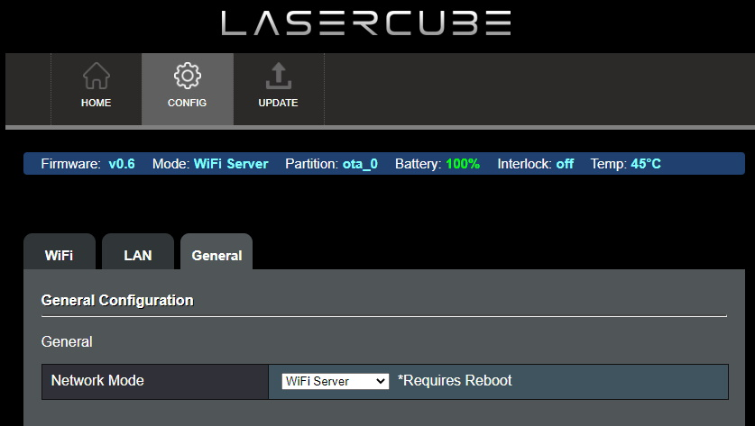

The network operating mode can be set from the drop down tab.

The LaserCube will reboot after changing the mode.

## Firmware Update

1\. Via SD Card. This is the preferred update method. If the SD Card has
a more recent firmware on it, you will be prompted to allow a firmware
update.

2\. Via LaserOS. If LaserOS detects a more recent version of firmware is
available, it will prompt to allow a firmware upgrade.

3\. Manually:

Visit **https://github.com/Wickedlasers/mk2SDContent** to obtain the
most recent OTA update binary from the **Lasercube/Firmware** folder.

Connect to the LaserCube in WiFi Server mode, as described in [Initial
Setup](#_418t1fsev28h).

Browse to 192.168.4.1 and log in using the following credentials:

User Name: **LaserCubeUser**

Password: **Laser2020**

Go to the Update Tab. Click Choose File and select the update binary.

Click Upload.

Wait for the update to complete and the LaserCube reboot.

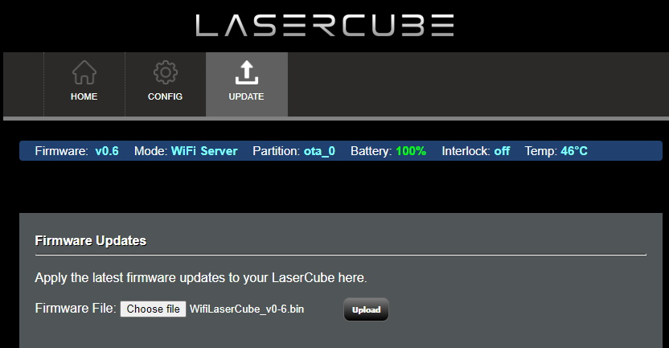

# Factory Reset Procedure

If you need to reset the MK2 laser cube back to its factory firmware
defaults, you can perform the factory reset as shown below. This should
only be done if absolutely necessary.

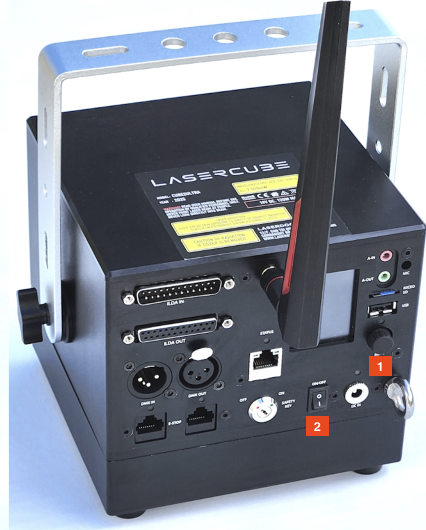

To Factory reset the MK2, firstly ensure the unit is powered OFF.

Hold the rotary encoder button down (1) and then while continuing to
hold the rotary encoder down, power on the unit using the power switch
(2). Keep holding the encoder down for at least 8 seconds and then
release the encoder button.

The unit will return to its factory firmware version and all settings
will also return to their defaults.

If an SD card is inserted and contains firmware that is newer than the
factory version, the unit will offer to immediately update to the latest
version. This should be done to ensure the latest firmware is running in
your device.

# SD Card Information

The Ultra MK2 laser cube is supplied with a pre-loaded micro SD card
containing all demo laser shows, Playlists, and MIDI mappings for APC40
MK2 and APC mini MK2.

If you need additional SD cards then these can be obtained from places
like Amazon.

The card which we have tested and guarantee to work with the MK2 is the
Lexar A2 Silver Plus 64Gb micro SD card
(<https://americas.lexar.com/product/lexar-professional-silver-plus-microsdxc-uhs-i-card/>).

The MK2 supports this range of cards up to 2Tb.

Note: Please make sure you do not purchase inferior / cheaper micro SD
cards, as these could fail to correctly stream the laser shows which
require low latency and high throughput in order to stream simultaneous
audio and projection data.

The micro SD cards usually come pre-formatted in the Ex-FAT filesystem
format, and this is the preferred format in order to take advantage of
\>32Gb space compared to FAT32.

If you need to format a card manually then please use Ex-FAT with
default settings offered by your operating system.

If you need to obtain the most up to date files that are provided on the
factory micro SD card then these are available from here:
<https://github.com/Wickedlasers/mk2SDContent>

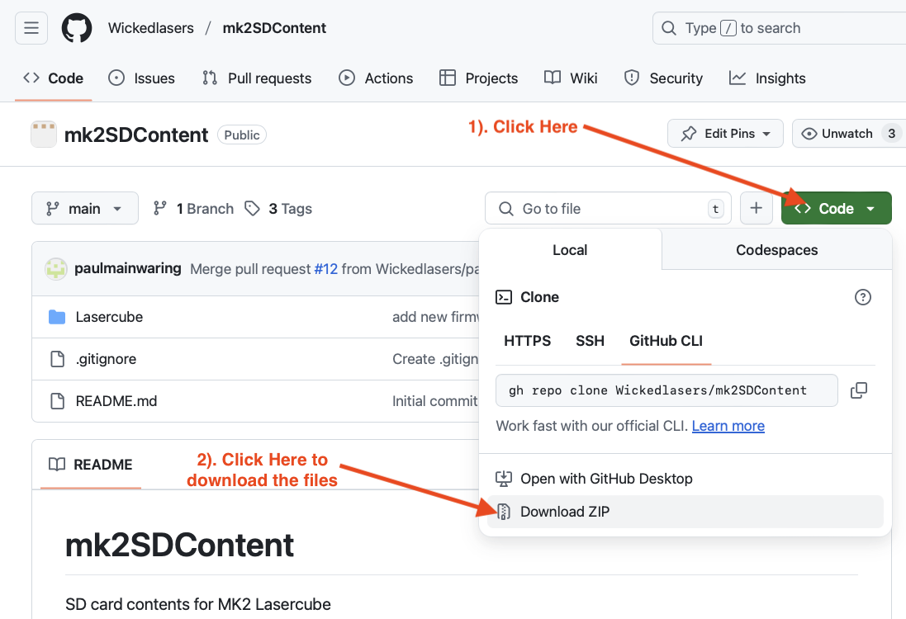

You will need to unzip the downloaded file before copying the
“Lasercube” folder into the root of your new micro SD card. If you are
using a card with the “Lasercube” folder already present then you can
either rename the old folder, or delete the folder before copying the
new folder you just downloaded. If you delete the folder then you will
**lose any custom playlists or MIDI mappings**.

Note: Please also rename the SD card volume name to “WL” without the
quotes in order for LaserOS to see it when exporting custom playlists to
the SD card.
